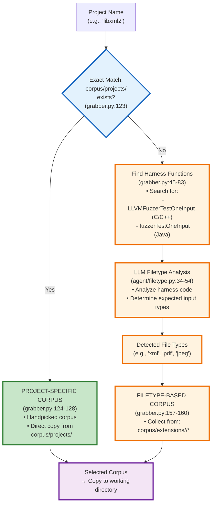

# Corpus Grabber Component Analysis

The Corpus Grabber component is an intelligent fuzzing corpus acquisition system that provides initial test inputs by either reusing project-specific corpora or dynamically determining file types through LLM analysis. It bridges the gap between traditional corpus collection and intelligent corpus selection.

**Main Workflow Entry Point**: [`components/corpusgrabber/task_handler.py`](https://github.com/Team-Atlanta/42-afc-crs/blob/main/components/corpusgrabber/task_handler.py)
- Listens to RabbitMQ queue (`corpus_queue`) for incoming tasks
- Processes tasks in parallel with configurable prefetch count
- Orchestrates corpus acquisition, project compilation, and downstream distribution

## Key Design Choice: Intelligent Corpus Selection

**🔑 N.B. Corpus Grabber operates with a TWO-TIER selection strategy:**

1. **Project-specific corpus** (if available): Direct corpus from `corpus/projects/<project_name>`
2. **Filetype-based corpus** (fallback): LLM determines expected file types from harness code

This design maximizes corpus quality while ensuring coverage for all projects:

```text
Task Arrival → Extract Archives → Corpus Selection → Build Project → Distribution
     ↓              ↓                    ↓                ↓              ↓
  Queue msg    Source + Fuzz       Project match?    Find harnesses   cmin_queue
              + Diff patches        or LLM detect                     + triage
```

## Key Corpus Match Algorithm



**Key Points:**
- **No fuzzy matching**: Only exact string matching for project names
- **Two-tier strategy**: Project-specific (priority) → Filetype-based (fallback)
- **LLM intelligence**: Analyzes harness code to determine appropriate file types when no exact match

The corpus grabber follows a sophisticated selection workflow with two distinct paths:

### Implementation Components

- **Task Reception**: [`task_handler.py#L256-308`](https://github.com/Team-Atlanta/42-afc-crs/blob/main/components/corpusgrabber/task_handler.py#L256)
- **Archive Extraction**: [`task_handler.py#L38-61`](https://github.com/Team-Atlanta/42-afc-crs/blob/main/components/corpusgrabber/task_handler.py#L38)
- **Diff Application**: [`task_handler.py#L88-110`](https://github.com/Team-Atlanta/42-afc-crs/blob/main/components/corpusgrabber/task_handler.py#L88)
- **Corpus Acquisition**: [`grabber.py#L115-165`](https://github.com/Team-Atlanta/42-afc-crs/blob/main/components/corpusgrabber/grabber.py#L115)
- **Project Building**: [`infra/oss_fuzz.py#L116-154`](https://github.com/Team-Atlanta/42-afc-crs/blob/main/components/corpusgrabber/infra/oss_fuzz.py#L116)
- **Fuzzer Discovery**: [`infra/oss_fuzz.py#L50-113`](https://github.com/Team-Atlanta/42-afc-crs/blob/main/components/corpusgrabber/infra/oss_fuzz.py#L50)
- **Database Storage**: [`task_handler.py#L122-161`](https://github.com/Team-Atlanta/42-afc-crs/blob/main/components/corpusgrabber/task_handler.py#L122)
- **CMIN Distribution**: [`task_handler.py#L217-254`](https://github.com/Team-Atlanta/42-afc-crs/blob/main/components/corpusgrabber/task_handler.py#L217)
- **Bug Creation**: [`task_handler.py#L163-214`](https://github.com/Team-Atlanta/42-afc-crs/blob/main/components/corpusgrabber/task_handler.py#L163)

## Corpus Selection Strategies

### 1. Project-Specific Corpus (Priority)
**Location**: `corpus/projects/<project_name>/`
- **When Used**: Project directory exists in corpus collection
- **Advantage**: Curated, project-optimized test inputs
- **Implementation**: [`grabber.py#L123-128`](https://github.com/Team-Atlanta/42-afc-crs/blob/main/components/corpusgrabber/grabber.py#L123)
- **Exact Match Proof**: [`grabber.py#L119-123`](https://github.com/Team-Atlanta/42-afc-crs/blob/main/components/corpusgrabber/grabber.py#L119) uses direct string concatenation and `os.path.isdir()` check:
  ```python
  project_dir = os.path.join(project_corpus, project_name)  # Line 119: Direct concatenation
  if os.path.isdir(project_dir):  # Line 123: Exact directory name check
  ```

### 2. Filetype-Based Corpus (Fallback)
**Location**: `corpus/extensions/<filetype>/`
- **When Used**: No project-specific corpus available
- **Process**:
  1. Find harness functions in source code ([`grabber.py#L45-83`](https://github.com/Team-Atlanta/42-afc-crs/blob/main/components/corpusgrabber/grabber.py#L45))
  2. LLM analyzes harness to determine expected file types ([`agent/filetype.py#L34-54`](https://github.com/Team-Atlanta/42-afc-crs/blob/main/components/corpusgrabber/agent/filetype.py#L34))
  3. Collect corpus files from extension directories ([`grabber.py#L157-160`](https://github.com/Team-Atlanta/42-afc-crs/blob/main/components/corpusgrabber/grabber.py#L157))
- **Supported Types**: All subdirectories under `corpus/extensions/`

## Corpus Data Pipeline

### Corpus Collection Sources and Preparation

**🔍 Important: The corpus collection goes beyond OSS-Fuzz:**

1. **Primary Collection Source** (Missing Implementation):
   - **PoC_crawler.py**: Referenced but not in codebase
   - Described as collecting from "available public sources"
   - Imported in [`tally.py#L7`](https://github.com/Team-Atlanta/42-afc-crs/blob/main/components/corpusgrabber/corpus/tally.py#L7)

2. **OSS-Fuzz Integration**:
   - Uses OSS-Fuzz project configurations ([`grabber.py#L19-21`](https://github.com/Team-Atlanta/42-afc-crs/blob/main/components/corpusgrabber/grabber.py#L19))
   - Clones main repositories from project.yaml configurations
   - Leverages OSS-Fuzz harness patterns for detection

3. **Manual Curated Corpus**:
   - Handpicked project-specific corpus in `corpus/projects/`
   - Available for: commons-compress, libxml2, libexif, zookeeper, freerdp, curl, tika, sqlite3
   - Likely collected from project test suites or known good inputs

### Corpus Preparation Pipeline

1. **File Type Classification via Magika** ([`PoC_type_classifier_Magika.py`](https://github.com/Team-Atlanta/42-afc-crs/blob/main/components/corpusgrabber/corpus/PoC_type_classifier_Magika.py)):
   - Uses Google's Magika ML-based file type detector
   - Creates symlinks in `extensions_magika/<filetype>/` directories
   - Processes all collected corpus files

2. **LLM-based Classification for Unknown Files** ([`PoC_type_classifier_LLM.py`](https://github.com/Team-Atlanta/42-afc-crs/blob/main/components/corpusgrabber/corpus/PoC_type_classifier_LLM.py)):
   - Handles files marked as "unknown" by Magika
   - Clones project repositories to find harness code
   - Uses LLM to analyze harness and determine expected file types
   - Creates appropriate directory structure in `extensions/`

3. **Statistical Analysis** ([`tally.py`](https://github.com/Team-Atlanta/42-afc-crs/blob/main/components/corpusgrabber/corpus/tally.py)):
   - Tracks corpus distribution by project and file type
   - Maintains project-to-filetype mappings

### No Fuzzy Matching for Project Names

**✅ Confirmed: The system uses EXACT string matching only**

Evidence:
1. **Direct Directory Lookup** ([`grabber.py#L123`](https://github.com/Team-Atlanta/42-afc-crs/blob/main/components/corpusgrabber/grabber.py#L123)):
   ```python
   if os.path.isdir(os.path.join(project_corpus, project_name))
   ```

2. **No Normalization or Similarity Algorithms**:
   - No imports of fuzzy matching libraries (e.g., fuzzywuzzy, difflib)
   - No string similarity calculations
   - No case normalization or character substitution

3. **Strict Validation** ([`grabber.py#L19-21`](https://github.com/Team-Atlanta/42-afc-crs/blob/main/components/corpusgrabber/grabber.py#L19)):
   - Raises `FileNotFoundError` if exact project name not found
   - No attempt at finding similar project names

**Design Rationale**: This strict matching ensures corpus quality - when a project-specific corpus is used, it's guaranteed to be for the exact project, eliminating false positives from similar project names

### Harness Detection Logic

The component uses different detection methods based on language:

| Language | Detection String | Search Location | File Type |
|----------|-----------------|-----------------|-----------|
| C/C++ | `LLVMFuzzerTestOneInput` | Binary executables in `build/out/<project>/` | Compiled binaries |
| Java/JVM | `fuzzerTestOneInput` | Source files in `projects/<project>/` | Java source files |

Implementation: [`infra/oss_fuzz.py#L66-102`](https://github.com/Team-Atlanta/42-afc-crs/blob/main/components/corpusgrabber/infra/oss_fuzz.py#L66)

## Integration Points

### Input Queue
- **Queue Name**: `corpus_queue`
- **Message Format**: [`README.md#L13-23`](https://github.com/Team-Atlanta/42-afc-crs/blob/main/components/corpusgrabber/README.md#L13)
- **Prefetch Count**: Configurable via `PREFETCH_COUNT` env var (default: 15)

### Output Queues

1. **CMIN Queue** (C/C++ only):
   - **Queue**: `cmin_queue`
   - **Message**: `{task_id, harness, seeds}`
   - **Purpose**: Corpus minimization before fuzzing

2. **Bug Table** (Direct triage):
   - **Table**: `bugs`
   - **Records**: One per corpus file × sanitizer × harness
   - **Purpose**: Immediate triage availability

### Database Schema
```sql
-- Seed storage
create table seeds (
    id           serial primary key,
    task_id      varchar not null references tasks,
    created_at   timestamp with time zone default now(),
    path         text,                    -- Path to corpus tar.gz
    harness_name text,                    -- "*" for corpus grabber
    fuzzer       fuzzertypeenum,           -- "corpus"
    coverage     double precision,         -- 0 for initial corpus
    metric       jsonb
);

-- Bug records for triage
create table bugs (
    task_id      varchar,
    architecture varchar,                  -- "x86_64"
    poc          text,                     -- Path to corpus file
    harness_name text,                     -- Specific harness
    sanitizer    text,                     -- From project.yaml
    sarif_report text                      -- NULL for corpus
);
```

## Key Design Decisions

1. **Two-Tier Selection**: Balances quality (project-specific) with coverage (filetype-based)
2. **LLM Integration**: Intelligent file type detection from harness analysis
3. **Language-Aware Processing**: Different strategies for C/C++ vs Java projects
4. **Parallel Distribution**: Simultaneous CMIN and triage submission
5. **Flat Corpus Structure**: All corpus files copied to single directory
6. **Docker-in-Docker**: Enables project building within container ([`Dockerfile#L1`](https://github.com/Team-Atlanta/42-afc-crs/blob/main/components/corpusgrabber/Dockerfile#L1))

## Telemetry and Monitoring

The component includes comprehensive telemetry:
- **OpenTelemetry Integration**: Traces corpus acquisition workflow
- **Span Attributes**: 
  - `crs.action.category`: "input_generation"
  - `crs.action.name`: "grab_fuzzing_corpus"
  - `crs.action.target`: Project name
  - `crs.action.target.filetypes`: Detected file types
  - `crs.action.target.harnesses`: Found harnesses
  - `crs.action.target.sanitizers`: Available sanitizers

## Error Handling

- **Retry Mechanism**: Up to 3 attempts with `x-retry` header tracking
- **Thread Safety**: Callbacks use `add_callback_threadsafe` for RabbitMQ operations
- **Graceful Degradation**: Falls back through multiple corpus sources
- **Docker Failures**: Validated before build attempts

## Downstream Integration

### With Bandfuzz Component
The bandfuzz fuzzer component ([`components/bandfuzz/internal/corpus/grab.go`](https://github.com/Team-Atlanta/42-afc-crs/blob/main/components/bandfuzz/internal/corpus/grab.go)) retrieves corpus through multiple grabbers in priority order:
1. LibCmin corpus (minimized)
2. DB seed corpus (from corpus grabber)
3. Cmin seeds
4. Mock/random seeds (fallback)

This ensures fuzzing can proceed even if corpus grabber fails, maintaining system resilience.