# Corpus Grabber Component Analysis

The Corpus Grabber component is an intelligent fuzzing corpus acquisition system that provides initial test inputs by either reusing project-specific corpora or dynamically determining file types through LLM analysis. It bridges the gap between traditional corpus collection and intelligent corpus selection.

**Main Workflow Entry Point**: [`components/corpusgrabber/task_handler.py`](https://github.com/Team-Atlanta/42-afc-crs/blob/main/components/corpusgrabber/task_handler.py)
- Listens to RabbitMQ queue (`corpus_queue`) for incoming tasks
- Processes tasks in parallel with configurable prefetch count
- Orchestrates corpus acquisition, project compilation, and downstream distribution

## Key Design Choice: Intelligent Corpus Selection

**🔑 N.B. Corpus Grabber operates with a TWO-TIER selection strategy:**

1. **Project-specific corpus** (if available): Direct corpus from `corpus/projects/<project_name>`
2. **Filetype-based corpus** (fallback): LLM determines expected file types from harness code

This design maximizes corpus quality while ensuring coverage for all projects:

```text
Task Arrival → Extract Archives → Corpus Selection → Build Project → Distribution
     ↓              ↓                    ↓                ↓              ↓
  Queue msg    Source + Fuzz       Project match?    Find harnesses   cmin_queue
              + Diff patches        or LLM detect                     + triage
```

## Overall Workflow

```mermaid
graph TB
    %% Input Task
    subgraph "Input Task Message"
        TASK["{<br/>task_id: '123',<br/>task_type: 'corpus',<br/>project_name: 'libxml2',<br/>focus: 'libxml2-2.9.10',<br/>repo: ['source.tar.gz'],<br/>fuzzing_tooling: 'oss-fuzz.tar.gz',<br/>diff: 'patch.tar.gz'<br/>}"]
    end
    
    %% Task Reception
    QUEUE["RabbitMQ<br/>corpus_queue"] --> LISTENER["Task Listener<br/>(task_handler.py:256-509)"]
    TASK --> QUEUE
    
    %% Thread Processing
    LISTENER --> THREAD["Process Thread<br/>(task_handler.py:309-422)<br/>• Retry logic<br/>• Telemetry tracking"]
    
    %% Archive Extraction
    THREAD --> EXTRACT["Extract Archives<br/>(task_handler.py:38-61)<br/>• Source repos<br/>• Fuzz tooling<br/>• Diff patches"]
    
    EXTRACT --> PATCH["Apply Diffs<br/>(task_handler.py:88-110)<br/>• Patch files<br/>• Update source"]
    
    %% Corpus Acquisition Strategy
    PATCH --> CORPUS_CHECK{"Project Corpus<br/>Exists?<br/>(grabber.py:123)"}
    
    CORPUS_CHECK -->|"Yes"| PROJECT_CORPUS["Use Project Corpus<br/>(grabber.py:124-128)<br/>• corpus/projects/<project>"]
    
    CORPUS_CHECK -->|"No"| LLM_DETECT["LLM Filetype Detection<br/>(grabber.py:136-161)"]
    
    %% LLM Detection Process
    LLM_DETECT --> FIND_HARNESS["Find Harness Files<br/>(grabber.py:45-83)<br/>• LLVMFuzzerTestOneInput<br/>• fuzzerTestOneInput"]
    
    FIND_HARNESS --> DETECT_TYPE["Detect File Types<br/>(agent/filetype.py:34-54)<br/>• Analyze harness code<br/>• Determine input types"]
    
    DETECT_TYPE --> FILETYPE_CORPUS["Collect Filetype Corpus<br/>(grabber.py:157-160)<br/>• corpus/extensions/<type>"]
    
    %% Build and Discovery
    PROJECT_CORPUS --> BUILD["Build Project<br/>(oss_fuzz.py:116-154)<br/>• Docker image<br/>• Compile fuzzers"]
    FILETYPE_CORPUS --> BUILD
    
    BUILD --> FIND_FUZZERS["Find Fuzzers<br/>(oss_fuzz.py:50-113)<br/>• Binary executables (C/C++)<br/>• Source files (Java)<br/>• Extract sanitizers"]
    
    %% Storage and Distribution
    FIND_FUZZERS --> SAVE_DB["Save to Database<br/>(task_handler.py:122-161)<br/>• Compress corpus<br/>• Store in /crs/corpus<br/>• Create seed record"]
    
    SAVE_DB --> LANGUAGE_CHECK{"Is Java<br/>Project?"}
    
    LANGUAGE_CHECK -->|"No (C/C++)"| CMIN["Send to CMIN<br/>(task_handler.py:217-254)<br/>• Per harness<br/>• cmin_queue"]
    
    LANGUAGE_CHECK -->|"Yes"| SKIP_CMIN["Skip CMIN"]
    
    %% Bug Creation for Triage
    SAVE_DB --> CREATE_BUGS["Create Bug Records<br/>(task_handler.py:163-214)<br/>• Per corpus file<br/>• Per sanitizer<br/>• Per harness"]
    
    CREATE_BUGS --> TRIAGE_DB["Save to Bug Table<br/>• Direct triage submission"]
    
    %% Success and Error Handling
    CMIN --> ACK["ACK Message<br/>(task_handler.py:424-431)"]
    SKIP_CMIN --> ACK
    TRIAGE_DB --> ACK
    
    BUILD --> |"On Error"| RETRY["Retry Logic<br/>(task_handler.py:392-419)<br/>• Max 3 attempts<br/>• x-retry header"]
    RETRY --> |"Retry < 3"| QUEUE
    RETRY --> |"Retry >= 3"| NACK["NACK Message<br/>Drop task"]
    
    %% Styling
    classDef input fill:#e1f5fe,stroke:#01579b,stroke-width:2px
    classDef decision fill:#fff3e0,stroke:#e65100,stroke-width:2px
    classDef corpus fill:#f3e5f5,stroke:#4a148c,stroke-width:2px
    classDef build fill:#e8f5e9,stroke:#1b5e20,stroke-width:2px
    classDef output fill:#c8e6c9,stroke:#2e7d32,stroke-width:2px
    
    class TASK input
    class CORPUS_CHECK,LANGUAGE_CHECK decision
    class PROJECT_CORPUS,LLM_DETECT,FIND_HARNESS,DETECT_TYPE,FILETYPE_CORPUS corpus
    class BUILD,FIND_FUZZERS build
    class SAVE_DB,CMIN,CREATE_BUGS,TRIAGE_DB,ACK output
```



The corpus grabber follows a sophisticated selection workflow with two distinct paths:

### Implementation Components

- **Task Reception**: [`task_handler.py#L256-308`](https://github.com/Team-Atlanta/42-afc-crs/blob/main/components/corpusgrabber/task_handler.py#L256)
- **Archive Extraction**: [`task_handler.py#L38-61`](https://github.com/Team-Atlanta/42-afc-crs/blob/main/components/corpusgrabber/task_handler.py#L38)
- **Diff Application**: [`task_handler.py#L88-110`](https://github.com/Team-Atlanta/42-afc-crs/blob/main/components/corpusgrabber/task_handler.py#L88)
- **Corpus Acquisition**: [`grabber.py#L115-165`](https://github.com/Team-Atlanta/42-afc-crs/blob/main/components/corpusgrabber/grabber.py#L115)
- **Project Building**: [`infra/oss_fuzz.py#L116-154`](https://github.com/Team-Atlanta/42-afc-crs/blob/main/components/corpusgrabber/infra/oss_fuzz.py#L116)
- **Fuzzer Discovery**: [`infra/oss_fuzz.py#L50-113`](https://github.com/Team-Atlanta/42-afc-crs/blob/main/components/corpusgrabber/infra/oss_fuzz.py#L50)
- **Database Storage**: [`task_handler.py#L122-161`](https://github.com/Team-Atlanta/42-afc-crs/blob/main/components/corpusgrabber/task_handler.py#L122)
- **CMIN Distribution**: [`task_handler.py#L217-254`](https://github.com/Team-Atlanta/42-afc-crs/blob/main/components/corpusgrabber/task_handler.py#L217)
- **Bug Creation**: [`task_handler.py#L163-214`](https://github.com/Team-Atlanta/42-afc-crs/blob/main/components/corpusgrabber/task_handler.py#L163)

## Corpus Selection Strategies

### 1. Project-Specific Corpus (Priority)
**Location**: `corpus/projects/<project_name>/`
- **When Used**: Project directory exists in corpus collection
- **Advantage**: Curated, project-optimized test inputs
- **Implementation**: [`grabber.py#L123-128`](https://github.com/Team-Atlanta/42-afc-crs/blob/main/components/corpusgrabber/grabber.py#L123)

### 2. Filetype-Based Corpus (Fallback)
**Location**: `corpus/extensions/<filetype>/`
- **When Used**: No project-specific corpus available
- **Process**:
  1. Find harness functions in source code ([`grabber.py#L45-83`](https://github.com/Team-Atlanta/42-afc-crs/blob/main/components/corpusgrabber/grabber.py#L45))
  2. LLM analyzes harness to determine expected file types ([`agent/filetype.py#L34-54`](https://github.com/Team-Atlanta/42-afc-crs/blob/main/components/corpusgrabber/agent/filetype.py#L34))
  3. Collect corpus files from extension directories ([`grabber.py#L157-160`](https://github.com/Team-Atlanta/42-afc-crs/blob/main/components/corpusgrabber/grabber.py#L157))
- **Supported Types**: All subdirectories under `corpus/extensions/`

## Corpus Data Pipeline

### Corpus Collection (Pre-deployment)
The corpus data is prepared through a multi-stage pipeline:

1. **Gathering** ([`README.md#L4`](https://github.com/Team-Atlanta/42-afc-crs/blob/main/components/corpusgrabber/README.md#L4)): Seeds collected from public sources via `corpus/PoC_crawler.py`
2. **Classification by Magika** ([`README.md#L5`](https://github.com/Team-Atlanta/42-afc-crs/blob/main/components/corpusgrabber/README.md#L5)): File type detection using Google's Magika tool
3. **LLM Classification** ([`README.md#L6`](https://github.com/Team-Atlanta/42-afc-crs/blob/main/components/corpusgrabber/README.md#L6)): Unknown files further classified by LLM

### Harness Detection Logic

The component uses different detection methods based on language:

| Language | Detection String | Search Location | File Type |
|----------|-----------------|-----------------|-----------|
| C/C++ | `LLVMFuzzerTestOneInput` | Binary executables in `build/out/<project>/` | Compiled binaries |
| Java/JVM | `fuzzerTestOneInput` | Source files in `projects/<project>/` | Java source files |

Implementation: [`infra/oss_fuzz.py#L66-102`](https://github.com/Team-Atlanta/42-afc-crs/blob/main/components/corpusgrabber/infra/oss_fuzz.py#L66)

## Integration Points

### Input Queue
- **Queue Name**: `corpus_queue`
- **Message Format**: [`README.md#L13-23`](https://github.com/Team-Atlanta/42-afc-crs/blob/main/components/corpusgrabber/README.md#L13)
- **Prefetch Count**: Configurable via `PREFETCH_COUNT` env var (default: 15)

### Output Queues

1. **CMIN Queue** (C/C++ only):
   - **Queue**: `cmin_queue`
   - **Message**: `{task_id, harness, seeds}`
   - **Purpose**: Corpus minimization before fuzzing

2. **Bug Table** (Direct triage):
   - **Table**: `bugs`
   - **Records**: One per corpus file × sanitizer × harness
   - **Purpose**: Immediate triage availability

### Database Schema
```sql
-- Seed storage
create table seeds (
    id           serial primary key,
    task_id      varchar not null references tasks,
    created_at   timestamp with time zone default now(),
    path         text,                    -- Path to corpus tar.gz
    harness_name text,                    -- "*" for corpus grabber
    fuzzer       fuzzertypeenum,           -- "corpus"
    coverage     double precision,         -- 0 for initial corpus
    metric       jsonb
);

-- Bug records for triage
create table bugs (
    task_id      varchar,
    architecture varchar,                  -- "x86_64"
    poc          text,                     -- Path to corpus file
    harness_name text,                     -- Specific harness
    sanitizer    text,                     -- From project.yaml
    sarif_report text                      -- NULL for corpus
);
```

## Key Design Decisions

1. **Two-Tier Selection**: Balances quality (project-specific) with coverage (filetype-based)
2. **LLM Integration**: Intelligent file type detection from harness analysis
3. **Language-Aware Processing**: Different strategies for C/C++ vs Java projects
4. **Parallel Distribution**: Simultaneous CMIN and triage submission
5. **Flat Corpus Structure**: All corpus files copied to single directory
6. **Docker-in-Docker**: Enables project building within container ([`Dockerfile#L1`](https://github.com/Team-Atlanta/42-afc-crs/blob/main/components/corpusgrabber/Dockerfile#L1))

## Telemetry and Monitoring

The component includes comprehensive telemetry:
- **OpenTelemetry Integration**: Traces corpus acquisition workflow
- **Span Attributes**: 
  - `crs.action.category`: "input_generation"
  - `crs.action.name`: "grab_fuzzing_corpus"
  - `crs.action.target`: Project name
  - `crs.action.target.filetypes`: Detected file types
  - `crs.action.target.harnesses`: Found harnesses
  - `crs.action.target.sanitizers`: Available sanitizers

## Error Handling

- **Retry Mechanism**: Up to 3 attempts with `x-retry` header tracking
- **Thread Safety**: Callbacks use `add_callback_threadsafe` for RabbitMQ operations
- **Graceful Degradation**: Falls back through multiple corpus sources
- **Docker Failures**: Validated before build attempts

## Downstream Integration

### With Bandfuzz Component
The bandfuzz fuzzer component ([`components/bandfuzz/internal/corpus/grab.go`](https://github.com/Team-Atlanta/42-afc-crs/blob/main/components/bandfuzz/internal/corpus/grab.go)) retrieves corpus through multiple grabbers in priority order:
1. LibCmin corpus (minimized)
2. DB seed corpus (from corpus grabber)
3. Cmin seeds
4. Mock/random seeds (fallback)

This ensures fuzzing can proceed even if corpus grabber fails, maintaining system resilience.