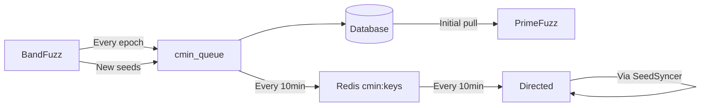

# Fuzzing Components

## Overview

The CRS employs three distinct fuzzing components that work together to find vulnerabilities:

1. **BandFuzz**: Collaborative fuzzing framework with scheduler-based resource management (C/C++ only)
2. **PrimeFuzz**: Message-driven continuous fuzzing service (all languages)
3. **Directed Fuzzing**: Delta-focused fuzzing targeting modified functions with language-specific implementations

## Component Comparison Table

| Aspect | BandFuzz | PrimeFuzz | Directed Fuzzing |
|--------|----------|-----------|------------------|
| **Mode Support** | Full only | Full and Delta | Delta only |
| **Java Support** | ❌ Explicitly skips ([builder.go#L318](https://github.com/Team-Atlanta/42-afc-crs/blob/main/components/bandfuzz/internal/builder/builder.go#L318)) | ✅ Full support via Jazzer | ✅ Via `javadirected` component |
| **Fuzzer Engines** | AFL++ only (LibFuzzer stub not implemented) | LibFuzzer, Jazzer | AFL++ (C/C++), Jazzer (Java) |
| **Execution Mode** | Epoch-based (configurable: 10min default, 15min prod, 30s dev) | Continuous long-running | Continuous until cancelled |
| **Termination** | After each epoch, new fuzzlet selected | Runs indefinitely | Runs until task cancelled |
| **Seed Sync** | After epoch → Cmin queue → DB | Initial pull only from DB | Every 10 minutes from Redis |
| **Corpus Management** | Batched (1024 seeds or 1min) → cmin_queue | OSS-Fuzz internal management | Active sync via SeedSyncer |
| **Resource Allocation** | Factor-based scoring (Task, Sanitizer weights) | OSS-Fuzz resource management | Master/slaves for C/C++, replicas for Java |
| **Primary Use Case** | Broad exploration with resource limits | Deep continuous fuzzing | Targeted delta fuzzing |

## Detailed Comparison

### Language Support

**BandFuzz**:
- **C/C++ ONLY** - Skips Java projects entirely ([builder.go#L316-321](https://github.com/Team-Atlanta/42-afc-crs/blob/main/components/bandfuzz/internal/builder/builder.go#L316))
- Detects language from project.yaml but only processes non-JVM projects
- Uses OSS-Fuzz build system but limited to AFL++ compatible targets

**PrimeFuzz**:
- **Full multi-language support** via OSS-Fuzz infrastructure
- Special handling for Java with Jazzer ([triage.py#L101](https://github.com/Team-Atlanta/42-afc-crs/blob/main/components/primefuzz/modules/triage.py#L101))
- Supports: C/C++, Java, Python, Rust, Go, JavaScript, and more
- Language-specific sanitizers and crash detection

**Directed Fuzzing**:
- **Dual-language support**: C/C++ via AFL++ allowlists, Java via Jazzer selective instrumentation
- **Implementation**: Two separate services (`directed` for C/C++, `javadirected` for Java)
- **Common approach**: Both use program slicing to identify and target modified functions

### Fuzzer Engines

**BandFuzz**:
- **AFL++ exclusively** ([aflpp.go#L66](https://github.com/Team-Atlanta/42-afc-crs/blob/main/components/bandfuzz/internal/fuzz/aflpp/aflpp.go#L66))
- LibFuzzer code exists but returns "not supported yet" ([libfuzzer.go#L22](https://github.com/Team-Atlanta/42-afc-crs/blob/main/components/bandfuzz/internal/fuzz/libfuzzer.go#L22))
- Supports AFL++ variants: "afl", "aflpp", "directed"

**PrimeFuzz**:
- **LibFuzzer** for C/C++ projects
- **Jazzer** for Java/JVM projects
- Uses OSS-Fuzz's native engine selection

**Directed Fuzzing**:
- **C/C++**: AFL++ with allowlist-based selective instrumentation ([fuzzer_runner.py#L151](https://github.com/Team-Atlanta/42-afc-crs/blob/main/components/directed/src/daemon/modules/fuzzer_runner.py#L151))
- **Java**: Jazzer with selective instrumentation via `javadirected` component
- Both use program slicing to identify code paths to modified functions

### Execution Models

**BandFuzz - Epoch-Based**:
```
Loop:
1. Fetch fuzzlets from Redis
2. Score and select one fuzzlet
3. Run fuzzer for epoch duration (configurable)
4. Terminate fuzzer
5. Collect new seeds → cmin_queue
6. Repeat with new fuzzlet selection
```
- Default epochs: 10 minutes ([config.go#L45](https://github.com/Team-Atlanta/42-afc-crs/blob/main/components/bandfuzz/config/config.go#L45))
- Production: 15 minutes ([values.yaml#L6](https://github.com/Team-Atlanta/42-afc-crs/blob/main/deployment/crs-k8s/b3yond-crs/charts/bandfuzz/values.yaml#L6))
- Development: 30 seconds ([docker-compose.yaml#L26](https://github.com/Team-Atlanta/42-afc-crs/blob/main/components/bandfuzz/docker-compose.yaml#L26))

**PrimeFuzz - Continuous**:
```
Single long-running process:
1. Pull initial seeds from DB
2. Start fuzzing continuously
3. No automatic termination
4. Corpus managed internally by OSS-Fuzz
```

**Directed - Continuous with Sync**:
```
Continuous with periodic sync:
1. Start AFL++ in distributed mode
2. Run SeedSyncer every 10 minutes
3. Pull minimized seeds from Redis (cmin:task:harness)
4. Continue until task cancelled
```

### Seed Synchronization

**BandFuzz**:
- **Active collection during fuzzing** ([seeds.go#L104-137](https://github.com/Team-Atlanta/42-afc-crs/blob/main/components/bandfuzz/internal/seeds/seeds.go#L104))
- Batching: 1024 seeds or 1-minute intervals
- Flow: Fuzzer → SeedManager → cmin_queue → Database
- Seeds persist across epochs via database

**PrimeFuzz**:
- **One-time initial pull** ([fuzzing_runner.py#L525](https://github.com/Team-Atlanta/42-afc-crs/blob/main/components/primefuzz/modules/fuzzing_runner.py#L525))
- Uses `db_manager.get_selected_seeds_corpus()`
- No active synchronization during runtime
- Relies on OSS-Fuzz internal corpus management

**Directed Fuzzing**:
- **Periodic synchronization** ([seed_syncer.py#L16](https://github.com/Team-Atlanta/42-afc-crs/blob/main/components/directed/src/daemon/modules/seed_syncer.py#L16))
- Checks Redis every 10 minutes (600s default interval)
- Pulls from `cmin:{task_id}:{harness}` keys ([seed_syncer.py#L72](https://github.com/Team-Atlanta/42-afc-crs/blob/main/components/directed/src/daemon/modules/seed_syncer.py#L72))
- Seeds shared across AFL++ instances via sync_dir ([seed_syncer.py#L63](https://github.com/Team-Atlanta/42-afc-crs/blob/main/components/directed/src/daemon/modules/seed_syncer.py#L63))

### Resource Management

**BandFuzz**:
- **Factor-based scoring** ([pick.go#L29-58](https://github.com/Team-Atlanta/42-afc-crs/blob/main/components/bandfuzz/internal/scheduler/pick.go#L29))
  - Task Factor: 1/num_fuzzlets_in_task ([simpleFactors.go#L11-31](https://github.com/Team-Atlanta/42-afc-crs/blob/main/components/bandfuzz/internal/scheduler/simpleFactors.go#L11))
  - Sanitizer Factor: ASAN=5, UBSAN=1, MSAN=1 ([simpleFactors.go#L37-52](https://github.com/Team-Atlanta/42-afc-crs/blob/main/components/bandfuzz/internal/scheduler/simpleFactors.go#L37))
- **Sanitizer allocation** ([afl.go#L26-108](https://github.com/Team-Atlanta/42-afc-crs/blob/main/components/bandfuzz/internal/builder/afl.go#L26))
  - Builds separate binaries per sanitizer
  - Creates fuzzlet for each harness×sanitizer combination ([upload.go#L55-73](https://github.com/Team-Atlanta/42-afc-crs/blob/main/components/bandfuzz/internal/builder/upload.go#L55))

**PrimeFuzz**:
- Delegates to OSS-Fuzz infrastructure
- No custom resource management
- Runs as configured in OSS-Fuzz project.yaml

**Directed Fuzzing**:
- AFL++ master/slave distribution
- Default 4 slaves per harness ([daemon.py#L354](https://github.com/Team-Atlanta/42-afc-crs/blob/main/components/directed/src/daemon/daemon.py#L354))
- Configurable via AIXCC_AFL_SLAVE_NUM environment variable

## Architectural Insights

### Division of Labor

The three components are **complementary, not redundant**:

1. **BandFuzz** handles native code with resource limits:
   - Best for: C/C++ projects needing controlled resource usage
   - Skips: Java/JVM projects entirely
   - Strength: Fair distribution across multiple tasks

2. **PrimeFuzz** provides deep, continuous fuzzing:
   - Best for: All languages, especially Java
   - Handles: Complex projects needing language-specific tools
   - Strength: Leverages full OSS-Fuzz capabilities

3. **Directed** targets code changes:
   - Best for: Delta fuzzing after patches
   - Focus: Modified functions in both C/C++ and Java
   - Strength: Efficient vulnerability discovery in changes using slicing and selective instrumentation

### Seed Flow Architecture



### Key Implementation Details

1. **Why BandFuzz skips Java**:
   - AFL++ cannot instrument JVM bytecode
   - Java needs specialized tools (Jazzer)
   - PrimeFuzz already handles Java effectively

2. **Why different sync strategies**:
   - BandFuzz: Frequent restarts need active sync
   - PrimeFuzz: Long-running trusts OSS-Fuzz management
   - Directed: Needs latest seeds for targeted fuzzing

3. **Resource efficiency trade-offs**:
   - BandFuzz: Higher overhead from restarts, better diversity
   - PrimeFuzz: Lower overhead, deeper exploration
   - Directed: Focused resources on likely vulnerable code

## Computing Resource Assignment

### Overall Resource Allocation Strategy

#### Task Mode Distribution

**Full Mode Tasks**:
- **Components activated**: PrimeFuzz + BandFuzz (configurable)
- **Resource allocation**:
  - PrimeFuzz: 8-16 pods × 8-16 CPUs = 64-256 CPUs total
  - BandFuzz: Environment-dependent (see below)
- **Queue routing**: Broadcast to all queues, both PrimeFuzz and BandFuzz can process

**Delta Mode Tasks**:
- **Components activated**: PrimeFuzz + Directed Fuzzing
- **Resource allocation**:
  - PrimeFuzz: 8-16 pods × 8-16 CPUs = 64-256 CPUs
  - Directed (C/C++): 0-8 jobs × 30 CPUs = 0-240 CPUs
  - Directed (Java): 2 pods × 4-8 CPUs = 8-16 CPUs
  - **Total**: Up to 512 CPUs for delta mode
- **Queue routing**:
  - PrimeFuzz: Processes via `prime_fuzzing_queue`
  - Directed: Processes via `directed_fuzzing_queue` (C/C++) and `java_directed_fuzzing_queue` (Java)

#### BandFuzz Environment-Specific Configuration

**Critical Finding**: BandFuzz replica count varies by environment!

| Environment | BandFuzz Replicas | CPU Allocation | Source |
|-------------|------------------|----------------|---------|
| **Production** | 24 pods | 720 CPUs (24×30) | [values.prod.yaml#L125](https://github.com/Team-Atlanta/42-afc-crs/blob/main/deployment/crs-k8s/b3yond-crs/values.prod.yaml#L125) |
| **Test** | 4 pods | 120 CPUs (4×30) | [values.test.yaml#L115](https://github.com/Team-Atlanta/42-afc-crs/blob/main/deployment/crs-k8s/b3yond-crs/values.test.yaml#L115) |
| **Development** | 1 pod | 30 CPUs | [values.dev.yaml#L126](https://github.com/Team-Atlanta/42-afc-crs/blob/main/deployment/crs-k8s/b3yond-crs/values.dev.yaml#L126) |
| **Base Chart** | 0 pods | 0 CPUs (disabled) | [charts/bandfuzz/values.yaml#L5](https://github.com/Team-Atlanta/42-afc-crs/blob/main/deployment/crs-k8s/b3yond-crs/charts/bandfuzz/values.yaml#L5) |

#### Resource Sharing Behavior

**Key Observations**:
1. **BandFuzz is environment-dependent**: Production runs 24 pods, base chart has 0
2. **PrimeFuzz handles both modes**: Runs continuously for all task types
3. **Directed is delta-only**: Spawns jobs/pods only when delta tasks arrive
4. **Competition deployment can enable BandFuzz**: Using appropriate values file

**Actual Resource Usage Pattern (Production)**:
```
Full Mode:  PrimeFuzz (64-256 CPUs) + BandFuzz (720 CPUs) = 784-976 CPUs
Delta Mode: PrimeFuzz (64-256 CPUs) + BandFuzz (720 CPUs) + Directed (8-256 CPUs) = 792-1232 CPUs
```

**Why This Allocation Strategy**:
- **Full mode gets massive resources in production**: Both PrimeFuzz and BandFuzz run
- **Delta mode adds directed fuzzing**: All three components active
- **BandFuzz can be toggled**: Environment-specific values allow dynamic enablement
- **Competition flexibility**: Can adjust based on available cluster resources

### Resource Allocation Overview

| Component | Deployment Type | Replicas | CPU Request | CPU Limit | Memory | Scaling Type | Scaling Mechanism |
|-----------|----------------|----------|-------------|-----------|---------|--------------|-------------------|
| **BandFuzz** | Deployment | 0-24 (env-dependent) | 30 CPUs | - | - | **Static** | None (configured via Helm) |
| **PrimeFuzz** | Deployment | 2 (base) | 8 CPUs | 16 CPUs | 16Gi | **Dynamic** | KEDA ScaledObject (8-16 replicas) |
| **Directed** | Mixed | See below | Varies | Varies | Varies | **Dynamic** | See below |

**Directed Fuzzing Resource Details**:
- **C/C++**: ScaledJob, 0-8 jobs, 30 CPUs each, KEDA ScaledJob
- **Java**: Deployment, 2 replicas, 4-8 CPUs each, KEDA ScaledObject

### Key Resource Management Features

#### 1. Static vs Dynamic Allocation

**BandFuzz - Static (Environment-Configurable)**:
- Static deployment with environment-specific replica counts
  - Production: 24 pods ([values.prod.yaml#L125](https://github.com/Team-Atlanta/42-afc-crs/blob/main/deployment/crs-k8s/b3yond-crs/values.prod.yaml#L125))
  - Test: 4 pods ([values.test.yaml#L115](https://github.com/Team-Atlanta/42-afc-crs/blob/main/deployment/crs-k8s/b3yond-crs/values.test.yaml#L115))
  - Development: 1 pod ([values.dev.yaml#L126](https://github.com/Team-Atlanta/42-afc-crs/blob/main/deployment/crs-k8s/b3yond-crs/values.dev.yaml#L126))
  - Base chart default: 0 pods ([values.yaml#L5](https://github.com/Team-Atlanta/42-afc-crs/blob/main/deployment/crs-k8s/b3yond-crs/charts/bandfuzz/values.yaml#L5))
- Each pod: 30 CPUs request, 28 cores for fuzzing
- No autoscaling (fixed replicas per environment)

**PrimeFuzz - Dynamic Scaling**:
- Base: 2 replicas, scales to 8-16 based on load ([scaled_object.yaml#L11-12](https://github.com/Team-Atlanta/42-afc-crs/blob/main/deployment/crs-k8s/b3yond-crs/charts/primefuzz/templates/scaled_object.yaml#L11))
- Scaling trigger: Docker-in-Docker container load metrics
- Resource range: 16-256 total CPUs (2-16 pods × 8-16 CPUs)
- Memory: 16Gi per pod

**Directed Fuzzing - Two Components**:

*C/C++ (Job-Based Scaling)*:
- ScaledJob: Creates 0-8 job instances on demand ([scaled_job.yaml#L10](https://github.com/Team-Atlanta/42-afc-crs/blob/main/deployment/crs-k8s/b3yond-crs/charts/directed/templates/scaled_job.yaml#L10))
- Scaling trigger: Queue length of `directed_fuzzing_queue`
- Each job: 30 CPUs (28 for AFL++ slaves via `AIXCC_AFL_SLAVE_NUM`)
- Jobs auto-terminate after processing (TTL: 300s)
- Skips JVM projects ([daemon.py#L170-172](https://github.com/Team-Atlanta/42-afc-crs/blob/main/components/directed/src/daemon/daemon.py#L170))

*Java (Deployment-Based)*:
- Uses PrimeFuzz image with `DIRECTED_MODE=True` environment variable
- Queue: `java_directed_fuzzing_queue` ([deployment.yaml#L63](https://github.com/Team-Atlanta/42-afc-crs/blob/main/deployment/crs-k8s/b3yond-crs/charts/javadirected/templates/deployment.yaml#L63))
- 2 replicas with 4-8 CPU cores each
- Uses Java slicer (`javaslice:task:` Redis keys) for selective instrumentation
- Jazzer with targeted fuzzing based on slicing results

#### 2. Full Mode vs Delta Mode Resources

**Important Finding**: No resource differentiation between modes!

Both full and delta tasks receive:
- Same CPU/memory allocations
- Same initial queue broadcast
- Same scaling policies

**Practical Differences**:
- **Task Broadcasting**: All tasks sent to all fuzzing queues via TaskBroadcastExchange ([task_routine.go#L118-126](https://github.com/Team-Atlanta/42-afc-crs/blob/main/components/scheduler/service/task_routine.go#L118))
- **Component Self-Selection**:
  - BandFuzz: Would process full mode C/C++ only (but disabled)
  - PrimeFuzz: Accepts both full and delta tasks, all languages
  - Directed: Only processes delta tasks that contain diff URLs
- **Queue Assignment** ([initializer.go#L41-44](https://github.com/Team-Atlanta/42-afc-crs/blob/main/components/scheduler/internal/messaging/initializer.go#L41)):
  ```go
  taskBroadcastGroup = []string{
      PrimeFuzzingQueue,
      GeneralFuzzingQueue,  // BandFuzz
      DirectedFuzzingQueue,
  }
  ```

#### 3. KEDA Autoscaling Configuration

**PrimeFuzz Scaling** ([scaled_object.yaml#L9-18](https://github.com/Team-Atlanta/42-afc-crs/blob/main/deployment/crs-k8s/b3yond-crs/charts/primefuzz/templates/scaled_object.yaml#L9)):
```yaml
pollingInterval: 60        # Check every 60 seconds
cooldownPeriod: 300        # Wait 5 minutes before scaling down
minReplicaCount: 8         # Minimum replicas (max_concurrent)
maxReplicaCount: 16        # Maximum replicas (2x max_concurrent)
triggers:
  - type: metrics-api
    url: "http://dind-prime-headless:8000/load"
    valueLocation: 'num_requested'
```

**Directed Scaling** ([scaled_job.yaml#L7-10](https://github.com/Team-Atlanta/42-afc-crs/blob/main/deployment/crs-k8s/b3yond-crs/charts/directed/templates/scaled_job.yaml#L7)):
```yaml
pollingInterval: 60
maxReplicaCount: 8
triggers:
  - type: metrics-api
    url: "http://scheduler:8080/queue?queue=directed_fuzzing_queue"
    valueLocation: 'length'
```

#### 4. Resource Utilization Analysis

**Theoretical Maximum Resources (Production)**:
- BandFuzz: 720 CPUs (24 pods × 30 CPUs)
- PrimeFuzz: 256 CPUs (16 pods × 16 CPU limit)
- Directed (C/C++): 240 CPUs (8 jobs × 30 CPUs)
- Directed (Java): 16 CPUs (2 pods × 8 CPU limit)
- **Total**: Up to 1232 CPUs at peak

**Actual Utilization Strategy**:
- Relies on non-overlapping peak loads
- KEDA prevents over-provisioning
- Jobs terminate quickly (Directed)
- Cooldown periods prevent thrashing

#### 5. Node Affinity and Distribution

All fuzzing components share:
- Node selector: `b3yond.org/role: user`
- Pod anti-affinity: Prevents co-location on same node
- Tolerations for dedicated fuzzing nodes
- Shared PVC: `/crs` mount for artifacts

### Resource Management Insights

1. **BandFuzz Environment-Configurable**:
   - Production runs 24 pods (720 CPUs total)
   - Can be disabled/enabled via Helm values
   - Provides massive C/C++ fuzzing capacity when enabled

2. **Dynamic Scaling Advantages**:
   - PrimeFuzz: Responds to container load
   - Directed: Spawns only for delta tasks
   - Efficient resource usage during low activity

3. **Inefficient Task Broadcasting**:
   - All tasks sent to all queues
   - Components must filter irrelevant tasks
   - Could optimize with routing keys by language/type

4. **Resource Oversubscription Design**:
   - Max 1232 CPUs in production (with all components enabled)
   - Assumes staggered peak loads
   - KEDA helps manage actual allocation for dynamic components
   - BandFuzz provides fixed baseline capacity

5. **No Delta Mode Optimization**:
   - Delta tasks don't get special resources
   - Same allocation as full mode
   - Only difference is component selection