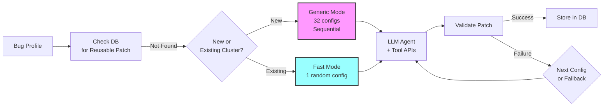

# PatchAgent: Automated Vulnerability Patching System

## Overview

PatchAgent is the automated vulnerability patching component of the CRS, responsible for generating and validating security patches for vulnerabilities discovered by the fuzzing pipeline. It employs an LLM-based approach with sophisticated tool integration to analyze vulnerabilities and synthesize appropriate fixes.

## High-Level Workflow

When PatchAgent receives a bug profile from the triage component:



**Key Steps**:
1. **Patch Reuse Check**: First checks if a validated patch already exists in the database
2. **Mode Selection**:
   - New bug clusters → Generic mode (exhaustive 32 configurations)
   - Existing clusters → Fast mode (single random configuration)
   - Every attempt auto-generates a fast mode fallback (priority 0)
3. **LLM Generation**: Uses GPT-4/Claude with `viewcode`, `locate`, and `validate` tools
   - Bug-type-specific repair advice automatically injected (see [CWE-Based Repair Advice](#cwe-based-repair-advice) below)
4. **Validation**: Tests patch against PoC and functional tests
5. **Storage/Retry**: Successful patches stored; failures trigger next configuration or fallback

## CWE-Based Repair Advice

PatchAgent implements **bug-type-specific patching strategies** through a comprehensive CWE (Common Weakness Enumeration) classification and repair advice system.

### Overview

**Implementation**: [`patchagent/parser/cwe.py`](https://github.com/Team-Atlanta/42-afc-crs/blob/main/components/patchagent/patchagent/parser/cwe.py)

- **40+ CWE types recognized** from sanitizer reports
- Each CWE has a **specific description** explaining the vulnerability nature
- Each CWE has **3-4 tailored repair steps** for fixing that bug type

### Supported Vulnerability Types

**AddressSanitizer CWEs** ([`address.py`](https://github.com/Team-Atlanta/42-afc-crs/blob/main/components/patchagent/patchagent/parser/address.py)):
- Heap/stack buffer overflow, use-after-free, double-free
- Null dereference, bad free, memory leak
- Stack use-after-return, stack use-after-scope
- Negative size param, function param overlap

**MemorySanitizer CWEs** ([`memory.py`](https://github.com/Team-Atlanta/42-afc-crs/blob/main/components/patchagent/patchagent/parser/memory.py)):
- Use of uninitialized memory

**UndefinedBehaviorSanitizer CWEs** ([`undefined.py`](https://github.com/Team-Atlanta/42-afc-crs/blob/main/components/patchagent/patchagent/parser/undefined.py)):
- Undefined behavior patterns

**Jazzer CWEs** ([`jazzer.py`](https://github.com/Team-Atlanta/42-afc-crs/blob/main/components/patchagent/patchagent/parser/jazzer.py)):
- Injection attacks (SQL, LDAP, command, XPath)
- Path traversal, RCE, SSRF
- Script engine injection, reflective call

### How It Works

**1. Sanitizer Report Parsing**

Each sanitizer report parser extracts the CWE type from the report content using regex patterns.

Example from [`address.py#L17-L38`](https://github.com/Team-Atlanta/42-afc-crs/blob/main/components/patchagent/patchagent/parser/address.py#L17-L38):
```python
SEARCH_PATTERNS = {
    CWE.Heap_buffer_overflow: r"==[0-9]+==ERROR: AddressSanitizer: heap-buffer-overflow",
    CWE.Heap_use_after_free: r"==[0-9]+==ERROR: AddressSanitizer: heap-use-after-free",
    CWE.Heap_double_free: r"==[0-9]+==ERROR: AddressSanitizer: attempting double-free",
    # ... 30+ more patterns
}
```

**2. Dynamic Report Enhancement**

The sanitizer report's `.summary` property ([`address.py#L101-L112`](https://github.com/Team-Atlanta/42-afc-crs/blob/main/components/patchagent/patchagent/parser/address.py#L101-L112)) constructs a bug-type-specific message:

```python
summary = (
    f"The sanitizer detected a {self.cwe.value} vulnerability. "
    f"The explanation of the vulnerability is: {CWE_DESCRIPTIONS[self.cwe]}. "
    f"Here is the detail: \n\n{self.purified_content}\n\n"
    f"To fix this issue, follow the advice below:\n\n{CWE_REPAIR_ADVICE[self.cwe]}"
)
```

**3. Injection into LLM Prompt**

The enhanced summary is injected into the user prompt ([`common.py#L73-L75`](https://github.com/Team-Atlanta/42-afc-crs/blob/main/components/patchagent/patchagent/agent/clike/common.py#L73-L75)):

```python
CLIKE_USER_PROMPT_TEMPLATE.format(
    project=self.task.project,
    report=self.task.report.summary,  # Contains CWE description + repair advice
    counterexamples=self.counterexamples,
)
```

### Example Repair Advice

**Heap Buffer Overflow** ([`cwe.py#L176-L183`](https://github.com/Team-Atlanta/42-afc-crs/blob/main/components/patchagent/patchagent/parser/cwe.py#L176-L183)):
```
1. If overflow is unavoidable, allocate a sufficiently large buffer during initialization.
2. Add explicit bounds checking before accessing arrays or buffers to prevent overflows.
3. Replace unsafe functions like memcpy, strcpy, strcat, and sprintf with safer alternatives such as strncpy, strncat, and snprintf.
4. Check for integer overflows in size calculations that could cause improper memory allocations.
```

**Use-After-Free** ([`cwe.py#L208-L216`](https://github.com/Team-Atlanta/42-afc-crs/blob/main/components/patchagent/patchagent/parser/cwe.py#L208-L216)):
```
1. Set pointers to NULL immediately after freeing them to prevent accidental reuse.
2. Ensure that each allocated memory block is freed only once.
3. Track memory allocations and deallocations systematically to prevent use-after-free conditions.
4. Consider swap the order of freeing memory and accessing it.
```

**SQL Injection** ([`cwe.py#L268-L274`](https://github.com/Team-Atlanta/42-afc-crs/blob/main/components/patchagent/patchagent/parser/cwe.py#L268-L274)):
```
1. Use parameterized queries or prepared statements to separate SQL code from user input.
2. Validate and sanitize all user inputs before incorporating them into SQL queries.
3. Implement input validation with allow-lists to restrict acceptable input patterns.
```

### Important Notes

**No Sanitizer-Specific Prompt Templates**:
- The C/C++ prompt template always says "asan report" regardless of actual sanitizer type (ASAN/MSAN/UBSAN/LeakSanitizer)
- There are no separate prompt templates for different sanitizers
- Sanitizer-specific information comes through the dynamic content in `{report}` variable

**Uniform Parameter Exploration**:
- All bug types use the same 32-configuration grid search (temperature, counterexamples, auto-hint)
- No per-CWE parameter tuning
- Specialization happens through **prompt content** (CWE-specific repair advice), not parameter values

**Coverage**: All sanitizer report types include CWE-based repair advice:
- AddressSanitizerReport, MemorySanitizerReport, UndefinedBehaviorSanitizerReport
- JazzerSanitizerReport, JavaNativeErrorReport

This approach provides **bug-type-specific guidance** to the LLM while maintaining a **simple, uniform patching pipeline** that works consistently across all vulnerability types.

## Documentation Structure

- [Prompt Templates](./patchagent-prompts.md)
- [Patch Validation](./patchagent-validation.md)
- [Counterexample Sampling](./patchagent-counterexample-sampling.md)
- [Auto-Hint System](./patchagent-autohint.md)
- [Fast vs Generic Modes](./patchagent-fast-vs-generic.md)
- [Academic vs AIxCC Implementation](./patchagent-aixcc-vs-paper.md)
- [Reproducer: Cross-Profile Validation (Partly Disabled)](./patchagent-cross-profile-validation.md)