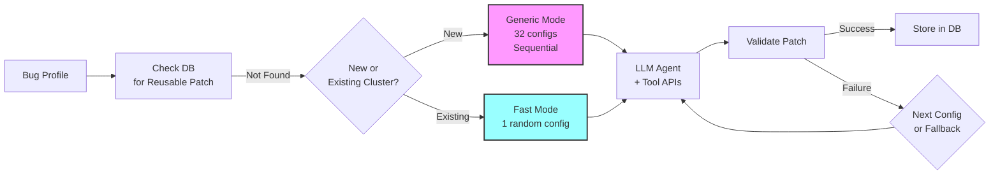

# PatchAgent: Automated Vulnerability Patching System

## Overview

PatchAgent is the automated vulnerability patching component of the CRS, responsible for generating and validating security patches for vulnerabilities discovered by the fuzzing pipeline. It employs an LLM-based approach with sophisticated tool integration to analyze vulnerabilities and synthesize appropriate fixes.

## High-Level Workflow

When PatchAgent receives a bug profile from the triage component:

**Key Steps**:
1. **Patch Reuse Check**: First checks if a validated patch already exists in the database
2. **Mode Selection**:
   - New bug clusters → Generic mode (exhaustive 32 configurations)
   - Existing clusters → Fast mode (single random configuration)
   - Every attempt auto-generates a fast mode fallback (priority 0)
3. **LLM Generation**: Uses GPT-4/Claude with `viewcode`, `locate`, and `validate` tools
4. **Validation**: Tests patch against PoC and functional tests
5. **Storage/Retry**: Successful patches stored; failures trigger next configuration or fallback

## Documentation Structure

- [Prompt Templates](./patchagent-prompts.md)
- [Patch Validation](./patchagent-validation.md)
- [Counterexample Sampling](./patchagent-counterexample-sampling.md)
- [Auto-Hint System](./patchagent-autohint.md)
- [Fast vs Generic Modes](./patchagent-fast-vs-generic.md)
- [Academic vs AIxCC Implementation](./patchagent-aixcc-vs-paper.md)
- [Reproducer: Cross-Profile Validation (Partly Disabled)](./patchagent-cross-profile-validation.md)