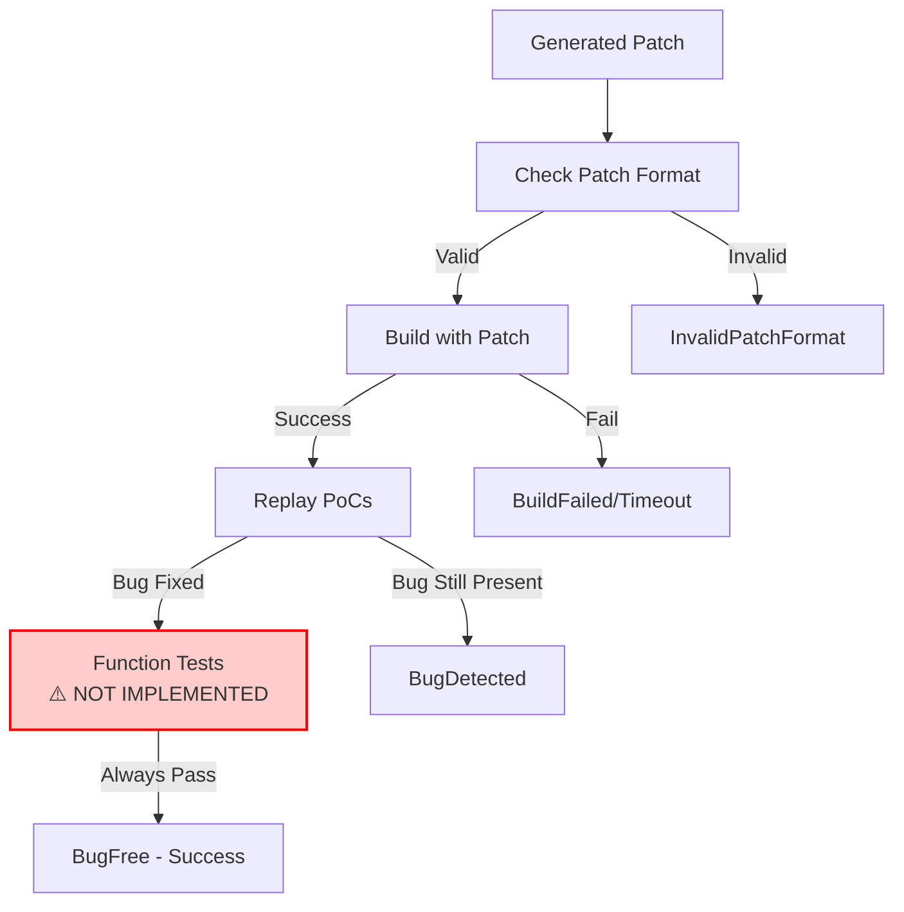

# Patch Validation: Multi-Stage Verification Pipeline

## Overview

Patch validation is a critical component of the PatchAgent system that ensures generated patches not only fix the target vulnerability but also maintain code correctness and don't introduce regressions. The validation occurs at two points: during patch generation (inline validation) and optionally during cross-profile testing (reproducer).

## Validation Workflow

### Inline Validation During Patch Generation

The primary validation occurs within the patch generation loop via the `validate()` method in [`patchagent/task.py`](https://github.com/Team-Atlanta/42-afc-crs/blob/main/components/patchagent/patchagent/task.py#L83-L113):



### Validation Stages and Results

The validation process returns specific `ValidationResult` enums to indicate the outcome:

| Stage | Success Result | Failure Results | Status |
|-------|---------------|-----------------|--------|
| **Patch Format Check** | Continue | `InvalidPatchFormat` | ✅ Implemented |
| **Build Verification** | Continue | `BuildFailed`, `BuildTimeout` | ✅ Implemented |
| **PoC Replay** | Continue | `BugDetected`, `ReplayFailed`, `ReplayTimeout` | ✅ Implemented |
| **Function Tests** | `BugFree` | `FunctionTestFailed`, `FunctionTestTimeout` | ❌ **NOT IMPLEMENTED** |

### Detailed Stage Analysis

#### 1. Patch Format Validation
**Location**: [`builder.py#L69-L79`](https://github.com/Team-Atlanta/42-afc-crs/blob/main/components/patchagent/patchagent/builder/builder.py#L69-L79)

```python
def check_patch(self, patch: str) -> None:
    self.source_repo.git.reset("--hard")
    self.source_repo.git.clean("-fdx")

    safe_subprocess_run(
        ["git", "apply"],  # empty patch is not allowed
        Path(self.source_repo.working_dir),
        input=patch.encode(),
    )
```

- Uses `git apply` to verify patch syntax
- Rejects empty patches
- Ensures patch can be cleanly applied to the codebase

#### 2. Build Verification
**Location**: [`task.py#L89-L94`](https://github.com/Team-Atlanta/42-afc-crs/blob/main/components/patchagent/patchagent/task.py#L89-L94)

```python
try:
    self.builder.build(patch)
except BuilderProcessError as e:
    return ValidationResult.BuildFailed, str(e)
except BuilderTimeoutError as e:
    return ValidationResult.BuildTimeout, str(e)
```

- Attempts to compile the patched code
- Uses OSS-Fuzz build infrastructure
- Ensures patch doesn't break compilation

#### 3. PoC Replay Testing
**Location**: [`task.py#L96-L104`](https://github.com/Team-Atlanta/42-afc-crs/blob/main/components/patchagent/patchagent/task.py#L96-L104)

```python
for poc in self.pocs:
    report = self.builder.replay(poc, patch)
    if report is not None:
        return ValidationResult.BugDetected, report.summary
```

- Runs the original proof-of-concept that triggered the vulnerability
- Tests with the patched binary
- If crash still occurs, patch is rejected with `BugDetected`
- Success means the vulnerability is fixed

#### 4. Functional Testing ❌ **NOT IMPLEMENTED**
**Location**: [`task.py#L106-L111`](https://github.com/Team-Atlanta/42-afc-crs/blob/main/components/patchagent/patchagent/task.py#L106-L111)

```python
try:
    self.builder.function_test(patch)  # ⚠️ EMPTY IMPLEMENTATION
except BuilderProcessError as e:
    return ValidationResult.FunctionTestFailed, str(e)
except BuilderTimeoutError as e:
    return ValidationResult.FunctionTestTimeout, str(e)
```

**⚠️ CRITICAL**: The `function_test()` method is **NOT IMPLEMENTED** ([`builder.py#L104`](https://github.com/Team-Atlanta/42-afc-crs/blob/main/components/patchagent/patchagent/builder/builder.py#L104)):

```python
def function_test(self, patch: str = "") -> None: ...  # Empty stub - no actual implementation
```

This means:
- **No functional tests are actually run** in the current implementation
- The validation always passes this stage
- Projects' existing test suites are not executed
- Regression testing is effectively disabled

## Validation Standards

### Success Criteria

A patch is considered successful (`BugFree`) only when ALL of the following are met:

1. **Valid Patch Format**: Must be a properly formatted diff/patch file
2. **Successful Build**: Code must compile without errors
3. **PoC Fixed**: Original vulnerability must be resolved (no crash on PoC)
4. **~~Function Tests Pass~~**: ❌ **NOT IMPLEMENTED** - Always passes, no regression checking

### Failure Handling

When validation fails during patch generation:

1. **During LLM Agent Interaction** ([`internal.py#L142-L164`](https://github.com/Team-Atlanta/42-afc-crs/blob/main/components/patchagent/patchagent/agent/clike/proxy/internal.py#L142-L164)):
   - Failure details are returned to the LLM
   - LLM gets up to `MAX_VALIDATION_TRIES` attempts (default: 10)
   - Revised patches may be automatically formatted before retry

2. **During Parameter Exploration**:
   - Generic mode moves to next configuration (out of 32)
   - Fast mode terminates (single configuration)
   - Automatic fallback messages are generated

### Patch Reuse Validation

When checking existing patches from the database ([`utils.py#L117-L120`](https://github.com/Team-Atlanta/42-afc-crs/blob/main/components/patchagent/patch_generator/utils.py#L117-L120)):

```python
result, report = PatchTask(
    copy_poc_to_builder([OSSFuzzPoC(Path(bug.poc), bug.harness_name)], builder),
    builder,
).validate(raw_patch)
```

- Existing patches undergo the same validation pipeline
- Results are cached in the `PatchBug` table
- Avoids redundant validation of known-good patches

## Functional Test Detection (Not Implemented)

### Intended Design

Based on the architecture, functional tests would be detected through:

1. **OSS-Fuzz Project Configuration**: Each project defines test commands
2. **Language-Specific Patterns**: Could detect common test frameworks:
   - C/C++: `make test`, `ctest`, `ninja test`
   - Java: `mvn test`, `gradle test`
   - Python: `pytest`, `unittest`

### Current Reality

- **No automatic test discovery** implemented
- **No test execution** occurs during validation
- Projects must rely solely on PoC-based validation
- Regression risks are not systematically checked

## Integration with Tool APIs

### Validate Tool for LLM

The validation is exposed to the LLM as a tool ([`default.py#L42-L68`](https://github.com/Team-Atlanta/42-afc-crs/blob/main/components/patchagent/patchagent/agent/clike/proxy/default.py#L42-L68)):

```python
def validate(patch: str) -> str:
    """
    Returns the validation result of the patch.
    The patch should be a multi-hunk patch...
    """
```

- LLM submits patches in standard diff format
- Receives human-readable validation reports
- Can iterate based on failure reasons

### Validation Result Processing

The agent proxy handles validation results ([`internal.py#L154-L156`](https://github.com/Team-Atlanta/42-afc-crs/blob/main/components/patchagent/patchagent/agent/clike/proxy/internal.py#L154-L156)):

```python
if ret == ValidationResult.BugFree:
    task.current_context.patch = patch
    raise PatchFoundException(patch)
```

- Success immediately terminates the agent with `PatchFoundException`
- Failures continue the conversation with error details
- Patch revision may occur automatically

## Performance Considerations

### Timeouts

- Build timeout: Configurable per project
- Replay timeout: Per-PoC limits
- Function test timeout: Would be configurable if implemented

### Caching

- Validated patches are stored with their validation status
- Cross-bug validation results cached in `PatchBug` table
- Avoids re-validating known patches

## Limitations and Gaps

1. **No Functional Testing**: The most significant gap - regression testing is disabled
2. **No Semantic Validation**: Only checks if patch applies and compiles
3. **Limited Cross-Profile Testing**: Handled separately by reproducer (partly disabled)
4. **No Performance Testing**: Patches could introduce performance regressions
5. **No Security Analysis**: Patches aren't checked for introducing new vulnerabilities

## Key Insights

1. **PoC-Centric Validation**: The system relies entirely on PoC replay for correctness
2. **Missing Regression Protection**: Without functional tests, patches may break existing functionality
3. **Fast Feedback Loop**: Validation results immediately influence LLM's next attempt
4. **Database-Backed Efficiency**: Patch reuse avoids redundant validation
5. **Production Compromise**: Functional testing was likely disabled for speed in competition context

The validation pipeline represents a pragmatic balance between thoroughness and speed, prioritizing vulnerability fixes over comprehensive testing - a reasonable tradeoff for the time-constrained AIxCC competition environment.