# SeedGen Full Mode (C/C++ Only)

Full Mode is a sophisticated seed generation strategy in the CRS, leveraging compiler instrumentation and dynamic analysis to produce high-quality seeds with maximal code coverage for C/C++ projects.

## Overview

Full Mode combines **static analysis**, **compiler instrumentation**, and **dynamic feedback** to generate seeds that achieve comprehensive code coverage. Unlike other modes, it instruments the entire codebase with custom LLVM passes and uses a containerized gRPC daemon (SeedD) for real-time coverage analysis.

## Architecture and Workflow

```mermaid
graph TB
    %% Input
    INPUT["INPUT<br/>━━━━━━━━━━━━━━━━━━━━━━━━━━━━<br/>• Task Message<br/>• project_name: 'libxml2'<br/>• src_path: source code<br/>• fuzz_tooling: OSS-Fuzz<br/>• gen_model: GPT-4.1/Claude/O4<br/>• harnesses: [binary1, binary2, ...]"]

    %% Stage 1: Instrumentation
    subgraph S1["STAGE 1: PROJECT INSTRUMENTATION"]
        direction TB
        COMPILE["compile_project()<br/>(aixcc.py:141-230)"]
        
        subgraph "Instrumentation Toolchain"
            ARGUS["clang-argus/clang-argus++<br/>Custom instrumented compilers"]
            BANDLD["bandld<br/>Custom linker"]
            LIBCG["libcallgraph_rt.a<br/>Call graph runtime"]
            CFPASS["SeedMindCFPass.so<br/>LLVM control flow pass"]
        end
        
        COMPILE --> ARGUS
        COMPILE --> BANDLD
        COMPILE --> LIBCG
        COMPILE --> CFPASS
    end

    OUT1["OUTPUT → STAGE 2<br/>━━━━━━━━━━━━━━━━━━━━━━━━━━━━<br/>• Docker image with instrumented binaries<br/>• Compilation database<br/>• Profile-enabled executables"]

    %% Stage 2: SeedD Daemon
    subgraph S2["STAGE 2: SEEDD DAEMON LAUNCH"]
        direction TB
        RUN_PROJECT["run_project()<br/>(aixcc.py:237-285)"]
        
        subgraph "Docker Container"
            SEEDD["SeedD gRPC Server<br/>Port 9002"]
            
            subgraph "gRPC Services"
                SVC1["RunSeeds<br/>Execute & collect coverage"]
                SVC2["GetRegionSource<br/>Code snippet retrieval"]
                SVC3["GetFunctions<br/>Function enumeration"]
                SVC4["GetCallGraph<br/>Call relationships"]
                SVC5["GetMergedCoverage<br/>Aggregate coverage data"]
            end
            
            SEEDD --> SVC1
            SEEDD --> SVC2
            SEEDD --> SVC3
            SEEDD --> SVC4
            SEEDD --> SVC5
        end
        
        subgraph "Mounted Volumes"
            VOL1["/out: Instrumented binaries"]
            VOL2["/work: Working directory"]
            VOL3["/shared: Inter-process comm"]
            VOL4["/seedd: Daemon binary"]
            VOL5["/getcov: Coverage tool"]
        end
        
        RUN_PROJECT --> SEEDD
    end

    OUT2["OUTPUT → STAGE 3<br/>━━━━━━━━━━━━━━━━━━━━━━━━━━━━<br/>• Container ID<br/>• IP Address for gRPC connection"]

    %% Stage 3: Parallel Harness Processing
    subgraph S3["STAGE 3: PARALLEL HARNESS PROCESSING"]
        direction TB
        PARALLEL["ThreadPoolExecutor<br/>(aixcc.py:723-751)"]
        
        H1["Harness 1<br/>SeedGenAgent"]
        H2["Harness 2<br/>SeedGenAgent"]
        HN["Harness N<br/>SeedGenAgent"]
        
        PARALLEL --> H1
        PARALLEL --> H2
        PARALLEL --> HN
    end

    OUT3["OUTPUT → STAGE 4<br/>━━━━━━━━━━━━━━━━━━━━━━━━━━━━<br/>• Individual harness processing tasks<br/>• gRPC connection details per agent"]

    %% Stage 4: SeedGenAgent Pipeline - Script Evolution
    subgraph S4["STAGE 4: SEEDGENAGENT PIPELINE - SCRIPT EVOLUTION (Per Harness)"]
        direction TB
        
        subgraph "Step 1: Function Discovery"
            GET_FUNCS["get_functions()<br/>via SeedD.GetFunctions()"]
            FIND_HARNESS["Find LLVMFuzzerTestOneInput<br/>Locate harness entry point"]
            GET_SOURCE["SeedD.GetRegionSource()<br/>Retrieve complete harness code"]
            
            GET_FUNCS --> FIND_HARNESS
            FIND_HARNESS --> GET_SOURCE
        end
        
        subgraph "Step 2: Initial Script Generation"
            GEN_FIRST["generate_first_script()<br/>(seedgen.py:125)"]
            
            subgraph "Creates Script v1"
                SOWBOT1["Sowbot: Analyze harness<br/>Generate Python script"]
                VALIDATE1["Validate & execute<br/>Generate 100 seeds"]
                COVERAGE1["Measure coverage<br/>Store as generator_0.py"]
            end
            
            GEN_FIRST --> SOWBOT1
            SOWBOT1 --> VALIDATE1
            VALIDATE1 --> COVERAGE1
        end
        
        SCRIPT1["📄 Script Version 1<br/>(Basic generator)<br/>Seeds: seed_0_0 to seed_0_99"]
        COVERAGE1 --> SCRIPT1
        
        subgraph "Step 3: Structure Documentation"
            UPDATE_DOC1["update_doc()<br/>(seedgen.py:128)"]
            ANALYZE1["Analyze coverage gaps<br/>Get related functions"]
            CREATE_DOC["Create structure documentation<br/>(NOT a script, just docs)"]
            
            UPDATE_DOC1 --> ANALYZE1
            ANALYZE1 --> CREATE_DOC
        end
        
        DOC1["📝 Documentation v1<br/>(Test case requirements)"]
        CREATE_DOC --> DOC1
        
        subgraph "Step 4: Filetype-Based Refinement"
            FILETYPE["_generate_filetype_seeds()<br/>(seedgen.py:132)"]
            GET_TYPE["Identify format<br/>(XML/JSON/binary)"]
            GEN_REF["Generate reference script<br/>Format-specific logic"]
            REPLACE1["REPLACE script with<br/>filetype-aware version"]
            
            FILETYPE --> GET_TYPE
            GET_TYPE --> GEN_REF
            GEN_REF --> REPLACE1
        end
        
        SCRIPT2["📄 Script Version 2<br/>(Filetype-aware)<br/>Seeds: seed_1_0 to seed_1_99"]
        REPLACE1 --> SCRIPT2
        
        subgraph "Step 5: Documentation Update"
            UPDATE_DOC2["update_doc()<br/>(seedgen.py:136)"]
            ANALYZE2["Analyze new coverage<br/>From filetype script"]
            IMPROVE_DOC["Improve documentation<br/>Add missing requirements"]
            
            UPDATE_DOC2 --> ANALYZE2
            ANALYZE2 --> IMPROVE_DOC
        end
        
        DOC2["📝 Documentation v2<br/>(Enhanced requirements)"]
        IMPROVE_DOC --> DOC2
        
        subgraph "Step 6: Final Alignment"
            ALIGN["align_script()<br/>(seedgen.py:139)"]
            ALIGN_PROMPT["Sowbot: Align script<br/>with documentation v2"]
            REPLACE2["REPLACE script with<br/>documentation-aligned version"]
            
            ALIGN --> ALIGN_PROMPT
            ALIGN_PROMPT --> REPLACE2
        end
        
        SCRIPT3["📄 Script Version 3<br/>(Final aligned)<br/>Seeds: seed_2_0 to seed_2_99"]
        REPLACE2 --> SCRIPT3
        
        subgraph "Step 7: Coverage Aggregation"
            MERGE_COV["get_merged_coverage()<br/>(seedgen.py:143)"]
            MERGE_PROF["Merge all .profdata files<br/>From all 300 seeds total"]
            FINAL_REPORT["Generate final report<br/>Overall coverage metrics"]
            
            MERGE_COV --> MERGE_PROF
            MERGE_PROF --> FINAL_REPORT
        end
        
        %% Flow connections
        GET_SOURCE --> GEN_FIRST
        SCRIPT1 --> UPDATE_DOC1
        DOC1 --> FILETYPE
        SCRIPT1 --> FILETYPE
        SCRIPT2 --> UPDATE_DOC2
        DOC2 --> ALIGN
        SCRIPT2 --> ALIGN
        SCRIPT3 --> MERGE_COV
        
        %% Styling for clarity
        style SCRIPT1 fill:#e8f5e9,stroke:#4caf50,stroke-width:2px
        style SCRIPT2 fill:#e3f2fd,stroke:#2196f3,stroke-width:2px
        style SCRIPT3 fill:#f3e5f5,stroke:#9c27b0,stroke-width:2px
        style DOC1 fill:#fff3e0,stroke:#ff9800,stroke-width:2px
        style DOC2 fill:#fff3e0,stroke:#ff9800,stroke-width:2px
    end

    OUT4["OUTPUT → STAGE 5<br/>━━━━━━━━━━━━━━━━━━━━━━━━━━━━<br/>• Generated seeds per harness<br/>• Coverage reports & metrics<br/>• Generator scripts"]

    %% Stage 5: Output Processing
    subgraph S5["STAGE 5: OUTPUT & STORAGE"]
        direction TB
        SAVE["save_result_to_db()<br/>(task_handler.py:236-290)"]
        
        subgraph "Artifacts"
            TAR["Compress seeds<br/>tar.gz format"]
            DB["Database record<br/>Coverage metrics"]
            STORAGE["Storage path<br/>/storage/seedgen/{task_id}/"]
        end
        
        SAVE --> TAR
        SAVE --> DB
        SAVE --> STORAGE
        
        CMIN_QUEUE["Send to cmin_queue<br/>Corpus minimization<br/>(C/C++ only)"]
        REDIS["Redis: seedgen:{task_id}:{model}:{harness}<br/>Mark as complete"]
        
        STORAGE --> CMIN_QUEUE
        STORAGE --> REDIS
    end

    FINAL_OUT["FINAL OUTPUT<br/>━━━━━━━━━━━━━━━━━━━━━━━━━━━━<br/>• Seeds archive: seedgen_{model}_{task_id}_{harness}.tar.gz<br/>• Coverage metrics in database<br/>• Seeds queued for corpus minimization"]

    %% Main flow connections (stage to stage)
    INPUT --> S1
    S1 --> OUT1
    OUT1 --> S2
    S2 --> OUT2
    OUT2 --> S3
    S3 --> OUT3
    OUT3 --> S4
    S4 --> OUT4
    OUT4 --> S5
    S5 --> FINAL_OUT

    %% Styling
    classDef inputOutput fill:#e1f5fe,stroke:#01579b,stroke-width:3px,color:#000
    classDef stage fill:#fff8e1,stroke:#f57f17,stroke-width:2px
    classDef instrumentation fill:#fff3e0,stroke:#f57c00,stroke-width:2px
    classDef daemon fill:#f3e5f5,stroke:#7b1fa2,stroke-width:2px
    classDef agent fill:#e8f5e9,stroke:#388e3c,stroke-width:2px
    classDef output fill:#fce4ec,stroke:#c2185b,stroke-width:2px
    classDef tool fill:#f5f5f5,stroke:#616161,stroke-width:1px
    
    class INPUT,OUT1,OUT2,OUT3,OUT4,FINAL_OUT inputOutput
    class S1,S2,S3,S4,S5 stage
    class COMPILE,ARGUS,BANDLD,LIBCG,CFPASS instrumentation
    class RUN_PROJECT,SEEDD,SVC1,SVC2,SVC3,SVC4,SVC5 daemon
    class H1,H2,HN,GET_FUNCS,GEN_FIRST,GET_TYPE,RUN_SEEDS,UPDATE_DOC,ALIGN,MERGE_COV agent
    class SAVE,TAR,DB,STORAGE,CMIN_QUEUE,REDIS output
    class GETCOV,PROFDATA tool
```



## Detailed Component Analysis

### 1. Project Instrumentation ([`compile_project`](https://github.com/Team-Atlanta/42-afc-crs/blob/main/components/seedgen/infra/aixcc.py#L141))

The instrumentation phase transforms the original source code into a heavily instrumented version that can provide detailed runtime information.

**Key Components:**

- **clang-argus/clang-argus++**: Custom Clang wrappers that inject instrumentation during compilation
  - Replaces standard CC/CXX compilers
  - Adds profiling callbacks at function entry/exit
  - Instruments control flow edges for coverage tracking

- **bandld**: Custom linker that ensures instrumentation libraries are properly linked
  - Links `libcallgraph_rt.a` runtime library
  - Preserves symbol information for dynamic analysis

- **SeedMindCFPass.so**: LLVM optimization pass for control flow instrumentation
  - Runs during the optimization phase
  - Adds edge counters for branch coverage
  - Instruments indirect calls for call graph construction

- **libcallgraph_rt.a**: Runtime library providing:
  - Call graph tracking during execution
  - Function entry/exit hooks
  - Coverage data collection infrastructure

**Environment Variables Set:**
```bash
BANDFUZZ_PROFILE=1          # Enable profiling mode
BANDFUZZ_RUNTIME=libcallgraph_rt.a  # Specify runtime library
ADD_ADDITIONAL_PASSES=SeedMindCFPass.so  # Add LLVM pass
GENERATE_COMPILATION_DATABASE=1  # Create compile_commands.json
```

### 2. SeedD Daemon ([`seedd`](https://github.com/Team-Atlanta/42-afc-crs/blob/main/components/seedgen/seedd/))

A Go-based gRPC service that provides dynamic analysis capabilities in an isolated Docker container.

**Core Services:**

1. **RunSeeds** ([`run_seeds.go`](https://github.com/Team-Atlanta/42-afc-crs/blob/main/components/seedgen/seedd/internal/service/run_seeds.go))
   - Executes seeds against instrumented binary
   - Uses `getcov` tool for coverage collection
   - Returns coverage percentage and detailed report
   - Generates `.profdata` files for LLVM coverage tools

2. **GetRegionSource** ([`get_region_source.go`](https://github.com/Team-Atlanta/42-afc-crs/blob/main/components/seedgen/seedd/internal/service/get_region_source.go))
   - Retrieves source code by file path and line/column ranges
   - Uses compilation database for accurate source mapping
   - Essential for understanding harness implementation

3. **GetFunctions** ([`functions.go`](https://github.com/Team-Atlanta/42-afc-crs/blob/main/components/seedgen/seedd/internal/service/functions.go))
   - Enumerates all functions in the instrumented binary
   - Provides metadata: file path, line numbers, signature
   - Identifies harness entry point (`LLVMFuzzerTestOneInput`)

4. **GetCallGraph** ([`callgraph.go`](https://github.com/Team-Atlanta/42-afc-crs/blob/main/components/seedgen/seedd/internal/service/callgraph.go))
   - Builds function call relationships from runtime data
   - Identifies which functions call which others
   - Used for understanding code dependencies

5. **GetMergedCoverage**
   - Aggregates coverage from all seed executions
   - Merges multiple `.profdata` files using `llvm-profdata`
   - Provides final coverage statistics

### 3. SeedGenAgent Pipeline ([`seedgen.py`](https://github.com/Team-Atlanta/42-afc-crs/blob/main/components/seedgen/seedgen2/seedgen.py))

The core orchestrator that manages the **script evolution process** - a single Python generator script is progressively refined through multiple stages to achieve better coverage.

**🔑 KEY INSIGHT: Script Evolution, Not Parallel Generation**

Unlike what might appear from the step numbering, this pipeline does NOT generate multiple scripts in parallel. Instead, it follows an iterative refinement approach where **ONE script evolves through replacements**:
- Script v1 (Basic) → Script v2 (Filetype-aware) → Script v3 (Documentation-aligned)  
- Each version completely replaces the previous one
- Each script generates 100 seeds when executed
- Total: 3 script versions × 100 seeds = 300 seeds for coverage analysis

```text
Script Evolution Pipeline:
┌─────────────┐     ┌──────────────┐     ┌─────────────┐
│   Script    │────▶│   Script     │────▶│   Script    │
│  Version 1  │     │  Version 2   │     │  Version 3  │
│   (Basic)   │     │ (Filetype)   │     │  (Aligned)  │
└─────────────┘     └──────────────┘     └─────────────┘
       ▲                    ▲                    ▲
       │                    │                    │
   Harness              Filetype            Documentation
   Analysis             Knowledge             Alignment
```

**Pipeline Stages:**

#### Step 1: Function Discovery
- Calls `SeedD.GetFunctions()` to enumerate all functions
- Locates `LLVMFuzzerTestOneInput` as harness entry point
- Retrieves complete harness source code via `GetRegionSource()`

#### Step 2: Initial Script Generation ([`generate_first_script`](https://github.com/Team-Atlanta/42-afc-crs/blob/main/components/seedgen/seedgen2/agents/glance.py) at [seedgen.py#L125](https://github.com/Team-Atlanta/42-afc-crs/blob/main/components/seedgen/seedgen2/seedgen.py#L125))
- Uses **Sowbot** graph (LangGraph-based workflow)
- LLM analyzes harness code to understand input requirements
- Prompt: [`PROMPT_GENERATE_FIRST_SCRIPT`](https://github.com/Team-Atlanta/42-afc-crs/blob/main/components/seedgen/seedgen2/agents/glance.py#L12)
- Generates the **FIRST Python script** that creates test inputs
- Validates script syntax and executes to create 100 initial seeds
- Stores as `generator_0.py`, seeds as `seed_0_0` to `seed_0_99`

#### Step 3: Structure Documentation Creation ([`update_doc`](https://github.com/Team-Atlanta/42-afc-crs/blob/main/components/seedgen/seedgen2/agents/alignment.py) at [seedgen.py#L128](https://github.com/Team-Atlanta/42-afc-crs/blob/main/components/seedgen/seedgen2/seedgen.py#L128))
- Analyzes coverage gaps from initial seeds
- Uses `get_related_functions()` to find dependent code
- Prompt: [`PROMPT_GENERATE_STRUCTURE_DOCUMENTATION`](https://github.com/Team-Atlanta/42-afc-crs/blob/main/components/seedgen/seedgen2/agents/alignment.py#L26)
- LLM generates documentation (NOT a script) describing:
  - Required input structure
  - Data field specifications
  - Edge cases for better coverage

#### Step 4: Filetype-Based Script Replacement ([`_generate_filetype_seeds`](https://github.com/Team-Atlanta/42-afc-crs/blob/main/components/seedgen/seedgen2/seedgen.py) at [seedgen.py#L132](https://github.com/Team-Atlanta/42-afc-crs/blob/main/components/seedgen/seedgen2/seedgen.py#L132))
- Identifies target file format (XML, JSON, binary, etc.)
  - Prompt: [`PROMPT_determine_file_type`](https://github.com/Team-Atlanta/42-afc-crs/blob/main/components/seedgen/seedgen2/agents/filetype.py#L11)
- Generates a reference script with format-specific logic
  - Prompt: [`PROMPT_reference`](https://github.com/Team-Atlanta/42-afc-crs/blob/main/components/seedgen/seedgen2/agents/filetype.py#L24)
- **REPLACES the original script** with filetype-aware version:
  - Prompt: [`PROMPT_generate`](https://github.com/Team-Atlanta/42-afc-crs/blob/main/components/seedgen/seedgen2/agents/filetype.py#L28)
  - **XML**: Proper tag structure, attributes, namespaces
  - **JSON**: Valid object/array structures, type constraints
  - **Binary**: Headers, magic bytes, checksums
- Stores as `generator_1.py`, seeds as `seed_1_0` to `seed_1_99`

#### Step 5: Documentation Enhancement ([`update_doc`](https://github.com/Team-Atlanta/42-afc-crs/blob/main/components/seedgen/seedgen2/agents/alignment.py) at [seedgen.py#L136](https://github.com/Team-Atlanta/42-afc-crs/blob/main/components/seedgen/seedgen2/seedgen.py#L136))
- Analyzes coverage from the filetype-aware script
- **Improves existing documentation** with new insights
- Prompt: [`PROMPT_IMPROVE_STRUCTURE_DOCUMENTATION`](https://github.com/Team-Atlanta/42-afc-crs/blob/main/components/seedgen/seedgen2/agents/alignment.py#L43)
- Adds missing requirements discovered from filetype script execution

#### Step 6: Final Script Alignment ([`align_script`](https://github.com/Team-Atlanta/42-afc-crs/blob/main/components/seedgen/seedgen2/agents/alignment.py) at [seedgen.py#L139](https://github.com/Team-Atlanta/42-afc-crs/blob/main/components/seedgen/seedgen2/seedgen.py#L139))
- Uses **Sowbot** graph (not Plainbot as documentation might suggest)
- **REPLACES the filetype script** with documentation-aligned version
- Prompt: [`PROMPT_ALIGNMENT`](https://github.com/Team-Atlanta/42-afc-crs/blob/main/components/seedgen/seedgen2/agents/alignment.py#L11)
- Ensures script follows all documented requirements
- Addresses remaining coverage gaps
- Stores as `generator_2.py`, seeds as `seed_2_0` to `seed_2_99`

#### Step 7: Coverage Aggregation ([`get_merged_coverage`](https://github.com/Team-Atlanta/42-afc-crs/blob/main/components/seedgen/seedgen2/utils/seeds.py) at [seedgen.py#L143](https://github.com/Team-Atlanta/42-afc-crs/blob/main/components/seedgen/seedgen2/seedgen.py#L143))
- Merges all `.profdata` files from all 300 seeds (3 scripts × 100 seeds each)
- Uses `llvm-profdata merge` for aggregation
- Calculates final coverage percentages
- Generates comprehensive coverage report

#### Sowbot vs Plainbot

Full Mode uses two distinct LangGraph-based workflows for different purposes:

##### **Sowbot** - Script Generation with Validation ([sowbot.py#L214-290](https://github.com/Team-Atlanta/42-afc-crs/blob/main/components/seedgen/seedgen2/graphs/sowbot.py#L214))
**Purpose**: Generate, validate, and execute Python generator scripts

**Graph Structure** (with error handling and retry):
```python
graph_builder.add_edge(START, "generate")
graph_builder.add_edge("generate", "validate_script")
graph_builder.add_conditional_edges("validate_script", 
    EDGE_error_happened,
    {True: "handle_error", False: END})
graph_builder.add_edge("handle_error", "validate_script")  # Retry on error
```

**Key Features**:
- Generates Python scripts that create seeds
- Validates script syntax before execution
- Executes script to generate 100 seeds per iteration
- Measures coverage using getcov tool
- Implements retry logic (up to 5 attempts) on errors
- Returns `SowbotResult` with script, seeds, and coverage feedback

**Usage in Pipeline**:
- Step 2: Initial script generation ([`PROMPT_GENERATE_FIRST_SCRIPT`](https://github.com/Team-Atlanta/42-afc-crs/blob/main/components/seedgen/seedgen2/agents/glance.py#L12))
- Step 4: Filetype-based script replacement ([`PROMPT_generate`](https://github.com/Team-Atlanta/42-afc-crs/blob/main/components/seedgen/seedgen2/agents/filetype.py#L28))
- Step 6: Final script alignment ([`PROMPT_ALIGNMENT`](https://github.com/Team-Atlanta/42-afc-crs/blob/main/components/seedgen/seedgen2/agents/alignment.py#L11))

##### **Plainbot** - Simple Text Generation ([plainbot.py#L41-75](https://github.com/Team-Atlanta/42-afc-crs/blob/main/components/seedgen/seedgen2/graphs/plainbot.py#L41))
**Purpose**: Generate plain text responses for documentation and analysis

**Graph Structure** (simple linear flow):
```python
graph_builder.add_edge(START, 'node_prompt')
graph_builder.add_edge('node_prompt', END)
```

**Key Features**:
- No validation or execution logic
- No error handling or retry mechanism
- Simply invokes LLM and returns text response
- Used for non-executable content generation

**Usage in Pipeline**:
- Step 3: Documentation generation ([`PROMPT_GENERATE_STRUCTURE_DOCUMENTATION`](https://github.com/Team-Atlanta/42-afc-crs/blob/main/components/seedgen/seedgen2/agents/alignment.py#L26))
- Step 4: Filetype identification ([`PROMPT_determine_file_type`](https://github.com/Team-Atlanta/42-afc-crs/blob/main/components/seedgen/seedgen2/agents/filetype.py#L11))
- Step 5: Documentation improvement ([`PROMPT_IMPROVE_STRUCTURE_DOCUMENTATION`](https://github.com/Team-Atlanta/42-afc-crs/blob/main/components/seedgen/seedgen2/agents/alignment.py#L43))

**Key Difference**: Sowbot generates and validates executable code with coverage feedback, while Plainbot generates text/documentation without execution.

### 4. Parallel Processing Architecture

Full Mode implements three levels of parallelism:

1. **Model-Level**: Multiple LLMs (GPT-4.1, Claude, O4-mini) process same task
2. **Harness-Level**: Each harness processed independently via ThreadPoolExecutor
3. **Seed-Level**: Multiple seeds executed concurrently for coverage analysis

### 5. Coverage Collection Tool ([`getcov`](https://github.com/Team-Atlanta/42-afc-crs/blob/main/components/seedgen/getcov/))

A Rust-based tool that bridges instrumented binaries with coverage analysis:

**Features:**
- Executes instrumented binary with seed inputs
- Collects LLVM coverage data via profiling runtime
- Outputs in multiple formats:
  - JSON for programmatic processing
  - Text for human readability
  - Hybrid for both use cases
- Batch processing for multiple seeds
- Integration with `llvm-profdata` and `llvm-cov` tools

**Execution Flow:**
```bash
getcov --hybrid -- /out/harness_binary seed_file
```

### 6. Output Storage and Distribution

**Artifacts Generated:**
- **Seeds Directory**: Contains all generated test inputs
- **Coverage Reports**: Detailed line/function/edge coverage
- **Generator Scripts**: Python scripts that produced the seeds
- **Profdata Files**: LLVM coverage data for further analysis

**Storage Structure:**
```
/storage/seedgen/{task_id}/
├── seedgen_{model}_{task_id}_{harness}.tar.gz
├── coverage_report.txt
└── metadata.json
```

**Database Record:**
- Task ID and harness name
- Coverage percentage achieved
- Storage path for seeds
- Generation timestamp
- Model used

**Queue Distribution:**
- Seeds sent to `cmin_queue` for corpus minimization
- Only for C/C++ projects (Java skips this step)
- Redis key marks completion for deduplication

## Key Advantages of Full Mode

1. **Real Coverage Feedback**: Unlike static analysis, Full Mode executes seeds and measures actual code coverage
2. **Iterative Refinement**: Uses coverage gaps to guide seed improvement
3. **Deep Instrumentation**: Tracks not just line coverage but also edges and indirect calls
4. **Format-Aware Generation**: Specialized generators for different file formats
5. **Scalable Architecture**: Containerized daemon allows parallel processing
6. **Comprehensive Analysis**: Combines static (source code) and dynamic (runtime) information

## Limitations

- **C/C++ Only**: Does not support Java/JVM projects due to instrumentation requirements
- **Resource Intensive**: Requires compilation, Docker containers, and significant compute
- **Time Consuming**: Full instrumentation and analysis takes longer than lightweight modes
- **Complex Setup**: Requires LLVM toolchain and custom instrumentation tools

## Implementation References

- Main orchestrator: [`run_full_mode()`](https://github.com/Team-Atlanta/42-afc-crs/blob/main/components/seedgen/infra/aixcc.py#L595-751)
- Agent implementation: [`SeedGenAgent`](https://github.com/Team-Atlanta/42-afc-crs/blob/main/components/seedgen/seedgen2/seedgen.py#L35-149)
- SeedD daemon: [`/components/seedgen/seedd/`](https://github.com/Team-Atlanta/42-afc-crs/blob/main/components/seedgen/seedd/)
- Coverage tool: [`/components/seedgen/getcov/`](https://github.com/Team-Atlanta/42-afc-crs/blob/main/components/seedgen/getcov/)
- Instrumentation tools: [`/components/seedgen/prebuilt/`](https://github.com/Team-Atlanta/42-afc-crs/blob/main/components/seedgen/prebuilt/)