# SeedGen MCP Mode (Model Context Protocol)

MCP Mode is an advanced seed generation strategy that leverages the **Model Context Protocol** to enable LLMs to directly interact with the codebase through standardized APIs. It provides **deep code understanding** without compilation or instrumentation, supporting **all programming languages** including Java/JVM projects that Full Mode cannot handle.

## Overview

MCP Mode combines **static code analysis**, **AST-based understanding**, and **LLM reasoning** to generate high-quality seeds without requiring compilation or dynamic execution. Unlike other modes, it establishes direct communication channels with the codebase through MCP servers, enabling sophisticated code exploration and backdoor detection capabilities.

**Key Characteristics:**
- **Language Support**: All languages (C/C++, Java/JVM, Python, etc.)
- **Compilation**: Not required
- **Code Analysis**: AST-based via Tree-sitter, filesystem access via MCP
- **Coverage Feedback**: None (static analysis only)
- **Script Evolution**: Single-pass generation with MCP-informed context
- **Special Feature**: Direct bug triage capability for discovered vulnerabilities

## Architecture and Workflow

```mermaid
graph TB
    %% Input
    INPUT["INPUT<br/>━━━━━━━━━━━━━━━━━━━━━━━━━━━━<br/>• Task Message<br/>• project_name<br/>• src_path: source code<br/>• fuzz_tooling: OSS-Fuzz<br/>• gen_model: GPT-4.1/Claude/O4<br/>• harnesses: [binary1, binary2, ...]<br/>• diff_dir: patch files"]

    %% Stage 1: Harness Discovery
    subgraph S1["STAGE 1: HARNESS DISCOVERY"]
        direction TB
        FIND["find_files_with_fuzzer_function()<br/>(aixcc.py:481-483)"]
        
        subgraph "Language Detection"
            JAVA_CHECK["Check if Java/JVM<br/>project_config['language']"]
            C_CHECK["Search for<br/>LLVMFuzzerTestOneInput"]
            JVM_CHECK["Search for<br/>fuzzerTestOneInput"]
        end
        
        FIND --> JAVA_CHECK
        JAVA_CHECK --> |"C/C++"| C_CHECK
        JAVA_CHECK --> |"Java/JVM"| JVM_CHECK
    end

    OUT1["OUTPUT → STAGE 2<br/>━━━━━━━━━━━━━━━━━━━━━━━━━━━━<br/>• harness_binaries: list of fuzzers<br/>• fuzzers: dict with source code<br/>• is_java: language flag"]

    %% Stage 2: MCP Infrastructure Setup
    subgraph S2["STAGE 2: MCP INFRASTRUCTURE SETUP"]
        direction TB
        
        subgraph "MCP Servers (Per Harness)"
            FS_SERVER["Filesystem Server<br/>@modelcontextprotocol/server-filesystem<br/>• Read/write file access<br/>• Directory traversal"]
            
            TS_SERVER["Tree-sitter Server<br/>mcp_server_tree_sitter<br/>• AST analysis<br/>• Code structure parsing<br/>• Symbol extraction"]
            
            subgraph "Tree-sitter Config"
                TS_CONFIG["treesitter_config.yaml<br/>• C/C++/Java support<br/>• Cache: 100MB, 300s TTL<br/>• Max file: 5MB<br/>• AST depth: 5"]
            end
            
            TS_SERVER --> TS_CONFIG
        end
        
        MCP_CLIENT["MultiServerMCPClient<br/>(seedmcp.py:38-54)<br/>Coordinates both servers"]
        
        MCP_CLIENT --> FS_SERVER
        MCP_CLIENT --> TS_SERVER
    end

    OUT2["OUTPUT → STAGE 3<br/>━━━━━━━━━━━━━━━━━━━━━━━━━━━━<br/>• MCP client with tools ready<br/>• Filesystem access to src_path<br/>• AST analysis capabilities"]

    %% Stage 3: Parallel Harness Processing
    subgraph S3["STAGE 3: PARALLEL HARNESS PROCESSING"]
        direction TB
        PARALLEL["ThreadPoolExecutor<br/>(aixcc.py:564-566)<br/>max_workers=len(harnesses)"]
        
        H1["Harness 1<br/>SeedMcpAgent"]
        H2["Harness 2<br/>SeedMcpAgent"]
        HN["Harness N<br/>SeedMcpAgent"]
        
        PARALLEL --> H1
        PARALLEL --> H2
        PARALLEL --> HN
    end

    OUT3["OUTPUT → STAGE 4<br/>━━━━━━━━━━━━━━━━━━━━━━━━━━━━<br/>• Individual harness processing tasks<br/>• MCP connections per agent"]

    %% Stage 4: SeedMcpAgent Pipeline
    subgraph S4["STAGE 4: SEEDMCPAGENT PIPELINE (Per Harness)"]
        direction TB
        
        subgraph "Step 1: Deep Code Analysis"
            CODE_ANALYSIS["initial_code_analysis()<br/>(glance.py:65-105)"]
            
            subgraph "CodeAnalysisAgent"
                REACT_AGENT["create_react_agent()<br/>with MCPAnalysisResponse"]
                MCP_TOOLS["MCP Tools:<br/>• register_project<br/>• search_project<br/>• get_function_definitions<br/>• get_references<br/>• file operations"]
                ANALYSIS_PROMPT["CODE_ANALYSIS_PROMPT<br/>AST analysis, backdoor detection,<br/>data structure discovery"]
            end
            
            CODE_ANALYSIS --> REACT_AGENT
            REACT_AGENT --> MCP_TOOLS
            MCP_TOOLS --> ANALYSIS_PROMPT
        end
        
        ANALYSIS_OUT["📊 Analysis Result<br/>• data_format_doc<br/>• code plan"]
        ANALYSIS_PROMPT --> ANALYSIS_OUT
        
        subgraph "Step 2: Initial Script Generation"
            GEN_FIRST["generate_first_script()<br/>(seedmcp.py:190-192)"]
            
            subgraph "With MCP Context"
                SOWBOT1["Sowbot (no SeedD)<br/>Includes analysis results"]
                VALIDATE1["Validate Python syntax<br/>Generate 100 seeds"]
                STORE1["Store as generator_0.py"]
            end
            
            GEN_FIRST --> SOWBOT1
            SOWBOT1 --> VALIDATE1
            VALIDATE1 --> STORE1
        end
        
        SCRIPT1["📄 Script Version 1<br/>(MCP-informed)<br/>Seeds: seed_0_0 to seed_0_99"]
        STORE1 --> SCRIPT1
        
        subgraph "Step 3: Structure Documentation"
            UPDATE_DOC["update_doc_mini()<br/>(seedmcp.py:193)"]
            DOC_GEN["Generate structure doc<br/>from harness source only<br/>(no SeedD coverage)"]
            
            UPDATE_DOC --> DOC_GEN
        end
        
        DOC1["📝 Documentation v1<br/>(Static analysis based)"]
        DOC_GEN --> DOC1
        
        subgraph "Step 4: Filetype Detection"
            FILETYPE["get_filetype()<br/>(seedmcp.py:194-200)"]
            DETECT["Identify format:<br/>XML/JSON/binary/text<br/>Remove quotes from result"]
            
            FILETYPE --> DETECT
        end
        
        FILETYPE_RESULT["File Format Type"]
        DETECT --> FILETYPE_RESULT
        
        subgraph "Step 5: Final Script Generation"
            BRANCH["filetype == 'unknown'?"]
            
            subgraph "Unknown Format Path"
                ALIGN_ONLY["align_script()<br/>Align with documentation"]
            end
            
            subgraph "Known Format Path"
                REF_SCRIPT["generate_reference_script()<br/>Format-specific template"]
                GEN_FILETYPE["generate_based_on_filetype()<br/>Combine all ingredients:<br/>• Script v1<br/>• Documentation<br/>• Reference template<br/>• Harness source<br/>• File format"]
            end
            
            BRANCH --> |"Yes"| ALIGN_ONLY
            BRANCH --> |"No"| REF_SCRIPT
            REF_SCRIPT --> GEN_FILETYPE
        end
        
        SCRIPT_FINAL["📄 Final Script<br/>(Complete generator)<br/>100 seeds per execution"]
        ALIGN_ONLY --> SCRIPT_FINAL
        GEN_FILETYPE --> SCRIPT_FINAL
        
        %% Flow connections
        ANALYSIS_OUT --> GEN_FIRST
        SCRIPT1 --> UPDATE_DOC
        SCRIPT1 --> FILETYPE
        DOC1 --> BRANCH
        FILETYPE_RESULT --> BRANCH
        
        %% Styling for clarity
        style ANALYSIS_OUT fill:#e8f5e9,stroke:#4caf50,stroke-width:2px
        style SCRIPT1 fill:#e3f2fd,stroke:#2196f3,stroke-width:2px
        style DOC1 fill:#fff3e0,stroke:#ff9800,stroke-width:2px
        style SCRIPT_FINAL fill:#f3e5f5,stroke:#9c27b0,stroke-width:2px
    end

    OUT4["OUTPUT → STAGE 5<br/>━━━━━━━━━━━━━━━━━━━━━━━━━━━━<br/>• Generated seeds per harness<br/>• Generator scripts<br/>• No coverage metrics (static only)"]

    %% Stage 5: Output Processing
    subgraph S5["STAGE 5: OUTPUT & DISTRIBUTION"]
        direction TB
        SAVE["save_result_func()<br/>(aixcc.py:529-539)"]
        
        subgraph "Storage"
            TAR["Compress seeds<br/>as tar.gz"]
            DB["Database record<br/>Task metadata"]
            STORAGE["Storage path<br/>/storage/seedgen/{task_id}/"]
        end
        
        SAVE --> TAR
        SAVE --> DB
        SAVE --> STORAGE
        
        TRIAGE["save_to_triage_func()<br/>(aixcc.py:541-554)<br/>Seeds → Bug Triage<br/>(Unique to MCP mode)"]
        
        REDIS["Redis: seedmcp:{task_id}:{model}:{harness}<br/>Mark as complete"]
        
        STORAGE --> TRIAGE
        STORAGE --> REDIS
    end

    FINAL_OUT["FINAL OUTPUT<br/>━━━━━━━━━━━━━━━━━━━━━━━━━━━━<br/>• Seeds: seedmcp_{model}_{task_id}_{harness}.tar.gz<br/>• Sent directly to triage queue<br/>• No corpus minimization<br/>• Supports all languages"]

    %% Main flow connections
    INPUT --> S1
    S1 --> OUT1
    OUT1 --> S2
    S2 --> OUT2
    OUT2 --> S3
    S3 --> OUT3
    OUT3 --> S4
    S4 --> OUT4
    OUT4 --> S5
    S5 --> FINAL_OUT

    %% Styling
    classDef inputOutput fill:#e1f5fe,stroke:#01579b,stroke-width:3px,color:#000
    classDef stage fill:#fff8e1,stroke:#f57f17,stroke-width:2px
    classDef mcp fill:#e8eaf6,stroke:#3f51b5,stroke-width:2px
    classDef agent fill:#e8f5e9,stroke:#388e3c,stroke-width:2px
    classDef output fill:#fce4ec,stroke:#c2185b,stroke-width:2px
    
    class INPUT,OUT1,OUT2,OUT3,OUT4,FINAL_OUT inputOutput
    class S1,S2,S3,S4,S5 stage
    class FS_SERVER,TS_SERVER,MCP_CLIENT,REACT_AGENT,MCP_TOOLS mcp
    class H1,H2,HN,CODE_ANALYSIS,GEN_FIRST,UPDATE_DOC,FILETYPE,BRANCH agent
    class SAVE,TAR,DB,STORAGE,TRIAGE,REDIS output
```



## Detailed Component Analysis

### 1. MCP Infrastructure ([`seedmcp.py#L38-54`](https://github.com/Team-Atlanta/42-afc-crs/blob/main/components/seedgen/seedgen2/seedmcp.py#L38))

MCP Mode establishes a sophisticated multi-server architecture for code analysis:

**Filesystem Server** (`@modelcontextprotocol/server-filesystem`):
- Provides direct file system access to the source code
- Enables reading/writing files without shell commands
- Scoped to the parent directory of `src_path` for security
- Runs as Node.js subprocess via `npx`
- Transport: stdio (standard input/output)

**Tree-sitter Server** (`mcp_server_tree_sitter`):
- Performs AST (Abstract Syntax Tree) analysis
- Configured via [`treesitter_config.yaml`](https://github.com/Team-Atlanta/42-afc-crs/blob/main/components/seedgen/treesitter_config.yaml#L1):
  ```yaml
  cache:
    enabled: true
    max_size_mb: 100
    ttl_seconds: 300
  security:
    max_file_size_mb: 5
    excluded_dirs: [.git, .venv, .tmp, node_modules, __pycache__]
    allowed_extensions: [c, cc, cpp, cxx, h, hpp, java]
  language:
    default_max_depth: 5
    preferred_languages: [c, java]
  ```
- Provides MCP tools for:
  - `register_project`: Register codebase for analysis
  - `search_project`: Find code patterns across files
  - `get_function_definitions`: Extract function signatures
  - `get_references`: Find usage of symbols
  - `get_ast`: Get AST representation (avoided due to token consumption)

**MultiServerMCPClient**:
- Coordinates both servers through a unified interface
- Manages subprocess lifecycle and communication
- Aggregates tools from both servers for the LLM agent

### 2. CodeAnalysisAgent ([`seedmcp.py#L32-146`](https://github.com/Team-Atlanta/42-afc-crs/blob/main/components/seedgen/seedgen2/seedmcp.py#L32))

A specialized agent that performs deep code analysis using MCP tools:

**React Agent Architecture**:
```python
# Agent setup with structured output
self.agent = create_react_agent(
    model_name, tools, response_format=MCPAnalysisResponse
)
# MCPAnalysisResponse enforces JSON structure:
# - data_format_doc: Input structure documentation
# - plan: Code generation strategy
```

**Analysis Process** ([`CODE_ANALYSIS_PROMPT`](https://github.com/Team-Atlanta/42-afc-crs/blob/main/components/seedgen/seedgen2/graphs/mcpbot.py#L33)):
1. **Entry Point Identification**:
   - C/C++: `LLVMFuzzerTestOneInput`
   - Java/JVM: `fuzzerTestOneInput`

2. **AST-based Analysis**:
   - Register project with Tree-sitter first
   - Avoid `get_ast` (too many tokens)
   - Focus on control flow and data dependencies

3. **Backdoor Detection**:
   - Searches for suspicious patterns: "aixcc", "jazzer"
   - Analyzes string literals and magic values
   - Identifies control flow manipulation points

4. **Data Structure Discovery**:
   - Constant strings and numbers
   - Headers and metadata fields
   - Data field specifications (type, encoding, constraints)
   - Control flow dependencies for fuzzing dictionaries

**Diff-Aware Analysis**:
```python
# When diff_dir is provided
if diff_path:
    with open(os.path.join(diff_path, "ref.diff"), 'r') as diff_file:
        diff_content = diff_file.read()
    # Include patch context for targeted seed generation
```

### 3. SeedMcpAgent Pipeline ([`seedmcp.py#L148-222`](https://github.com/Team-Atlanta/42-afc-crs/blob/main/components/seedgen/seedgen2/seedmcp.py#L148))

The main orchestrator that manages seed generation without dynamic analysis:

#### Step 1: Deep Code Analysis ([`seedmcp.py#L180-187`](https://github.com/Team-Atlanta/42-afc-crs/blob/main/components/seedgen/seedgen2/seedmcp.py#L180))
```python
code_analysis_result = initial_code_analysis(
    CodeAnalysisAgent(self.harness_source, str(self.src_dir.absolute())),
    self.harness_source,
    self.harness_binary,
    str(self.src_dir.absolute()),
    str(self.diff_dir.absolute()) if self.diff_dir else None,
)
```
- Instantiates `CodeAnalysisAgent` with MCP servers
- Performs comprehensive codebase analysis
- Extracts data structures and generates code plan
- Uses context model (`SeedGen2ContextModel`) for deeper understanding
- Recursion limit of 30 for complex analysis tasks

#### Step 2: Initial Script Generation ([`seedmcp.py#L190-192`](https://github.com/Team-Atlanta/42-afc-crs/blob/main/components/seedgen/seedgen2/seedmcp.py#L190))
```python
current_result = generate_first_script(
    None,  # No SeedD daemon in MCP mode
    self.harness_source,
    self.harness_binary,
    additional_context=code_analysis_result
)
```
- Uses Sowbot graph **without SeedD** (key difference from Full Mode)
- Incorporates MCP analysis results as additional context
- Generates Python script informed by codebase understanding
- Validates and executes to produce 100 seeds
- Stores as `generator_0.py`

#### Step 3: Structure Documentation ([`seedmcp.py#L193`](https://github.com/Team-Atlanta/42-afc-crs/blob/main/components/seedgen/seedgen2/seedmcp.py#L193))
```python
current_doc = update_doc_mini(self.harness_source, self.harness_binary)
```
- Uses `update_doc_mini()` - simplified version without coverage feedback
- Generates documentation from harness source only
- Creates test case requirements and edge cases
- No dynamic coverage information available

#### Step 4: Filetype Detection ([`seedmcp.py#L194-200`](https://github.com/Team-Atlanta/42-afc-crs/blob/main/components/seedgen/seedgen2/seedmcp.py#L194))
```python
filetype_result = get_filetype(
    harness_source_code=self.harness_source,
    harness_file_name=self.harness_binary,
    project_name=self.project_name,
)
filetype_result = filetype_result.translate(str.maketrans('', '', "\"'`"))
```
- Identifies target file format: XML/JSON/binary/text
- Removes quotes and ticks from result string
- Determines generation strategy based on format

#### Step 5: Final Script Generation ([`seedmcp.py#L203-221`](https://github.com/Team-Atlanta/42-afc-crs/blob/main/components/seedgen/seedgen2/seedmcp.py#L203))
```python
if filetype_result == "unknown":
    # Simple alignment with documentation
    current_result = align_script(None, current_script, current_doc, self.harness_binary)
else:
    # Format-specific generation
    reference_script = generate_reference_script(None, self.harness_binary, filetype_result)
    current_result = generate_based_on_filetype(
        None, current_script, current_doc, self.harness_binary,
        self.harness_source, filetype_result, True, reference_script
    )
```
- **Unknown format**: Aligns script with documentation only
- **Known format**: Combines multiple ingredients:
  - Initial script (MCP-informed)
  - Structure documentation
  - Format-specific reference template
  - Harness source code
  - File format knowledge

### 4. MCPbot Graph ([`mcpbot.py#L240-259`](https://github.com/Team-Atlanta/42-afc-crs/blob/main/components/seedgen/seedgen2/graphs/mcpbot.py#L240))

A specialized LangGraph workflow for MCP-based generation:

**Graph Structure**:
```python
def build_generate_graph():
    graph_builder = StateGraph(GenerateState)
    
    # Add nodes
    graph_builder.add_node("generate", GenerationNode())
    graph_builder.add_node("validate_script", ScriptValidationNode())
    graph_builder.add_node("handle_error", ErrorHandlingNode())
    
    # Configure edges with error handling
    graph_builder.add_edge(START, "generate")
    graph_builder.add_edge("generate", "validate_script")
    graph_builder.add_conditional_edges(
        "validate_script", EDGE_error_happened,
        {True: "handle_error", False: END}
    )
    graph_builder.add_edge("handle_error", "validate_script")  # Retry
```

**Key Features**:
- **GenerationNode**: Invokes LLM with MCP-enhanced prompt
- **ScriptValidationNode**: Extracts, validates, and executes Python script
- **ErrorHandlingNode**: Handles failures with up to 5 retry attempts
- **Script Extraction**: Uses regex to extract code from triple backticks
- **Execution**: Via `SeedGeneratorStore` for isolated execution

### 5. Parallel Processing Architecture

MCP Mode implements two levels of parallelism:

1. **Model-Level Parallelism** ([`task_handler.py#L464-470`](https://github.com/Team-Atlanta/42-afc-crs/blob/main/components/seedgen/task_handler.py#L464)):
   - Multiple LLMs process same task: GPT-4.1, Claude-4-sonnet, O4-mini
   - Controlled by `GEN_MODEL_LIST` environment variable
   - Each model runs independently with same MCP infrastructure

2. **Harness-Level Parallelism** ([`aixcc.py#L564-566`](https://github.com/Team-Atlanta/42-afc-crs/blob/main/components/seedgen/infra/aixcc.py#L564)):
   ```python
   with ThreadPoolExecutor(max_workers=len(harness_binaries)) as executor:
       futures = [executor.submit(process_harness, hb, context.get_current())
                  for hb in harness_binaries]
   ```
   - Each harness processed independently
   - Separate MCP server instances per harness
   - Redis deduplication check before processing

### 6. Output Storage and Distribution

**Unique Feature - Direct Bug Triage** ([`aixcc.py#L541-554`](https://github.com/Team-Atlanta/42-afc-crs/blob/main/components/seedgen/infra/aixcc.py#L541)):
```python
if save_to_triage_func:
    sanitizers = []
    if "sanitizers" in project_config:
        for sanitizer in project_config["sanitizers"]:
            sanitizers.append(sanitizer)
    
    save_to_triage_func(
        task,
        os.path.join(fuzzer_dir, "seeds"),
        sanitizers,
        [harness_binary],
        storage_dir,
        database_url
    )
```
- Seeds treated as potential bugs immediately
- Sent directly to triage queue for analysis
- Includes sanitizer configurations from project
- Bypasses corpus minimization entirely

**Storage Structure**:
```
/storage/seedgen/{task_id}/
├── seedmcp_{model}_{task_id}_{harness}.tar.gz
├── seeds/
│   ├── generator_0.py
│   ├── seed_0_0
│   ├── seed_0_1
│   └── ...
└── metadata.json
```

**Redis Tracking**:
- Key format: `seedmcp:{task_id}:{model}:{harness}`
- Prevents duplicate processing
- Marks completion with "done" value

## Comparison with Other Modes

| Aspect | MCP Mode | Full Mode | Mini Mode |
|--------|----------|-----------|-----------|
| **Language Support** | All languages | C/C++ only | All languages |
| **Compilation Required** | No | Yes (instrumented) | No |
| **Code Analysis** | AST via MCP servers | Dynamic via SeedD | Static (harness only) |
| **Coverage Feedback** | None | Yes (real execution) | None |
| **Script Evolution** | Single-pass with context | 3 iterations with refinement | Single generation |
| **Execution Time** | Medium | Slow | Fast |
| **Infrastructure** | MCP servers (Node.js/Python) | SeedD, getcov, LLVM | Docker only |
| **Bug Triage** | Direct submission | Via corpus minimization | Via corpus minimization |
| **Backdoor Detection** | Yes (active search) | No | No |
| **Diff Awareness** | Yes | No | No |

## Key Advantages

1. **Universal Language Support**: Works with any programming language the Tree-sitter supports
2. **No Build Complexity**: Eliminates compilation and instrumentation overhead
3. **Deep Code Understanding**: Direct AST analysis and codebase exploration
4. **Security Analysis**: Active backdoor and vulnerability pattern detection
5. **Diff-Aware Generation**: Can target recently modified code paths
6. **Direct Bug Discovery**: Immediate triage submission for potential vulnerabilities
7. **Rich Context**: Combines static analysis with LLM reasoning
8. **Scalable Infrastructure**: MCP servers can be reused across tasks

## Limitations

1. **No Dynamic Coverage**: Cannot measure actual code execution paths
2. **Static Analysis Only**: Misses runtime behavior and execution patterns
3. **Token Intensive**: MCP analysis can consume significant LLM tokens
4. **No Iterative Refinement**: Single-pass generation without coverage feedback
5. **Server Dependencies**: Requires Node.js and Python runtime environments
6. **AST Depth Limits**: Default 5-level traversal may miss deeply nested structures
7. **File Size Limits**: 5MB maximum file size for analysis

## Configuration and Deployment

**Environment Variables**:
```bash
ENABLE_MCP=1  # Enable MCP mode in task_handler.py
GEN_MODEL_LIST="gpt-4o,claude-4-sonnet,o4-mini"  # Models to use
```

**Tree-sitter Configuration** ([`treesitter_config.yaml`](https://github.com/Team-Atlanta/42-afc-crs/blob/main/components/seedgen/treesitter_config.yaml)):
- Cache: 100MB with 5-minute TTL
- Security: Excludes sensitive directories, limits file size
- Languages: Pre-loads C and Java parsers
- Performance: Default 5-level AST depth, 100 max results

**MCP Server Requirements**:
- Node.js for filesystem server (`npx` command)
- Python 3 for tree-sitter server
- Network: stdio transport (no network ports required)

## Implementation References

- **Main Orchestrator**: [`run_mcp_mode()`](https://github.com/Team-Atlanta/42-afc-crs/blob/main/components/seedgen/infra/aixcc.py#L461-593)
- **Agent Implementation**: [`SeedMcpAgent`](https://github.com/Team-Atlanta/42-afc-crs/blob/main/components/seedgen/seedgen2/seedmcp.py#L148-222)
- **Code Analysis**: [`CodeAnalysisAgent`](https://github.com/Team-Atlanta/42-afc-crs/blob/main/components/seedgen/seedgen2/seedmcp.py#L32-146)
- **MCPbot Graph**: [`mcpbot.py`](https://github.com/Team-Atlanta/42-afc-crs/blob/main/components/seedgen/seedgen2/graphs/mcpbot.py)
- **Configuration**: [`treesitter_config.yaml`](https://github.com/Team-Atlanta/42-afc-crs/blob/main/components/seedgen/treesitter_config.yaml)
- **Deployment**: [`deployment.yaml#L63`](https://github.com/Team-Atlanta/42-afc-crs/blob/main/deployment/crs-k8s/b3yond-crs/charts/seedgen/templates/deployment.yaml#L63)